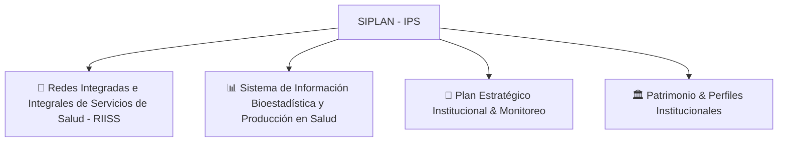

# SIPLAN — Portal de Documentación Técnica y Funcional

Bienvenido a la documentación técnica y funcional del **Sistema Integrado de Planificación (SIPLAN)** del **Instituto de Previsión Social (IPS)**.

---

## 📚 Módulos del Sistema

---

## 📑 Índices de Documentación por Módulo

### 🏥 [1. Módulo RIISS (Red de Salud IPS)](./riiss/README.md)
Documentación completa del módulo de evaluación, relevamiento in situ, tipología de complejidad, marco de equiparación MSPBS ↔ IPS, constructor de formularios dinámicos en 5 dimensiones, regulación farmacéutica y portal validador digital.

1. [01. Modelo Funcional y Marco Normativo](./riiss/01-modelo-funcional-y-marco-legal.md)
2. [02. Arquitectura de Software y Módulos](./riiss/02-arquitectura-y-modulos.md)
3. [03. Modelo de Datos y Diagrama ER](./riiss/03-modelo-datos-y-er.md)
4. [04. Dimensiones Estratégicas y Constructor Drag & Drop](./riiss/04-dimensiones-y-constructor-drag-drop.md)
5. [05. Matriz de Equiparación MSPBS ↔ IPS](./riiss/05-matriz-equiparacion-mspbs-ips.md)
6. [06. Portal Validador y Regulación Farmacéutica](./riiss/06-portal-validador-y-regulacion-farmaceutica.md)
7. [07. Relevamiento In Situ y Motor de Gap Analysis](./riiss/07-relevamiento-in-situ-y-evaluaciones.md)
8. [08. Fichas Técnicas Públicas, Actas y Reportes PDF](./riiss/08-actas-fichas-tecnicas-y-reportes.md)
9. [09. Guía de Seeders, Ingestión y Mantenimiento](./riiss/09-seeders-ingestion-y-mantenimiento.md)

---

### 📊 [2. Módulo de Bioestadística](./bioestadistica/README.md)
Documentación del subsistema de bioestadística, planillas de producción mensual SP (SP1 al SP14), árbol de órganos del organigrama, hospitalización, captura y diccionarios de variables.

---

### 🏛️ Estándares Institucionales
* **Entidad**: Instituto de Previsión Social (IPS) — República del Paraguay.
* **Dependencia Líder**: Dirección de Planificación.
* **Plataforma Base**: Laravel (PHP 8.2+), PostgreSQL, DataTables, Sortable.js, Leaflet y DomPDF.
