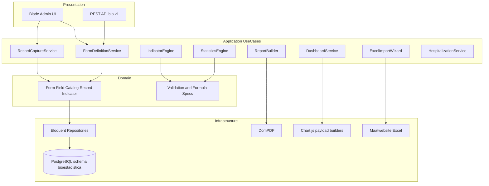

# 02 — Arquitectura

## Enfoque

Clean Architecture adaptada a Laravel 10, sin romper las convenciones que ya usa SIPLAN
(controladores por dominio en `app/Http/Controllers/Admin/...`, modelos Eloquent, vistas Blade).

## Capas



## Responsabilidades

### Domain

Value objects y reglas puras, sin Facades ni Eloquent:

- `FieldType` — enum de tipos de campo
- `Periodicity` — enum de periodicidad
- `StatPeriod` — par (año, mes) del período estadístico
- `FormulaAst` — árbol de fórmula de indicador
- `RecordState` — máquina de estados del registro
- `ValidationSpec` — obligatorio, mínimo, máximo, regex

### Application

Casos de uso orquestadores:

| Servicio | Responsabilidad |
|---|---|
| `FormDefinitionService` | Crear, editar, versionar y publicar formularios |
| `RecordCaptureService` | Validar y persistir registros y valores |
| `IndicatorEngine` | Evaluar AST de fórmulas con filtros |
| `StatisticsEngine` | Frecuencias, medidas de tendencia y dispersión |
| `ReportBuilder` | Construir dataset tabular y exportarlo |
| `DashboardService` | Resolver widgets y devolver series listas |
| `ExcelImportWizard` | Detectar, mapear y confirmar importaciones |
| `HospitalizationService` | Episodios SP10 y sus indicadores derivados |

### Infrastructure

- Modelos Eloquent en `app/Models/Bioestadistica`
- Migraciones sobre el schema `bioestadistica`
- Lectores Excel, exportadores PDF/CSV/XLSX
- Constructores de payload para Chart.js

### Presentation

- Controladores Blade en `app/Http/Controllers/Admin/Bioestadistica`
- Controladores API en `app/Http/Controllers/Api/Bioestadistica`
- Vistas en `resources/views/admin/bioestadistica`

## Estructura de carpetas

```
app/
  Domain/Bioestadistica/
    Enums/            FieldType, Periodicity, RecordState, LayoutType
    ValueObjects/     StatPeriod, FormulaAst, ValidationSpec
  Application/Bioestadistica/
    Forms/            FormDefinitionService, PublishForm
    Records/          RecordCaptureService, RecordValidator
    Indicators/       IndicatorEngine, FormulaEvaluator
    Statistics/       StatisticsEngine
    Reports/          ReportBuilder
    Dashboards/       DashboardService
    Imports/          ExcelImportWizard, VariablesImporter,
                      EstablecimientosImporter, FormulariosSpImporter
    Hospitalization/  HospitalizationService
  Infrastructure/Bioestadistica/
    Repositories/     Implementaciones Eloquent
    Export/           PdfExporter, CsvExporter, XlsxExporter
    Charts/           ChartPayloadBuilder
  Models/Bioestadistica/
    Departamento, Distrito, Establecimiento, Microred,
    TipoEstablecimiento, GradoComplejidad, AreaGestion,
    Formulario, FormSeccion, Field, Catalogo, CatalogItem,
    VariableDefinition, Record, RecordValue,
    Indicador, IndicadorFormula, Dashboard, DashboardWidget,
    Reporte, HospEpisodio, AuditLog, ImportJob
  Http/Controllers/Admin/Bioestadistica/
  Http/Controllers/Api/Bioestadistica/
resources/views/admin/bioestadistica/
docs/bioestadistica/
```

## Aislamiento respecto de otros módulos

| Regla | Detalle |
|---|---|
| Schema propio | Todas las tablas en `bioestadistica.*` |
| Sin FK cruzadas | Ninguna FK hacia `public`, `estadistica`, `planificacion`, `proyecto` |
| Excepción controlada | `user_id` referencia usuarios del sistema (auditoría y dashboards personales) |
| Geografía propia | No se usa `public.establecimientos` (RIISS) ni `localities` |
| Sin tocar código ajeno | No se modifican controladores, modelos ni vistas de SIESS, RIISS o PEI |

Único cambio previsto fuera del módulo: agregar la redirección post-login del rol
Analista de Bioestadística en `LoginController` (una línea, sin alterar el resto).

## Convenciones

- Migraciones: `Schema::connection('pgsql')` con nombres calificados `bioestadistica.tabla`
- Claves primarias: `bigserial`
- Timestamps en todas las tablas; `softDeletes` en tablas de metadata
- JSONB para configuración flexible (`config`, `meta`, fórmulas, layout de widgets)
- Nombres de tablas y columnas en español, consistente con el resto de SIPLAN
