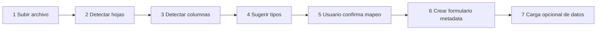

# 06 — Importación Excel

Dos caminos que comparten la misma infraestructura:

1. **Wizard genérico**: cualquier Excel se convierte en formulario dinámico.
2. **Importadores dedicados**: los tres archivos de `.docs-bio/`, con reglas de negocio propias.

Librería: `maatwebsite/excel` (PhpSpreadsheet), agregada solo para este módulo.

## Wizard genérico



| Paso | Detalle |
|---|---|
| 1 | Archivo `.xls` / `.xlsx` a `storage/bioestadistica/imports`, fila en `import_jobs` estado `subido` |
| 2 | Lista de hojas con conteo de filas y columnas; estado `analizado` |
| 3 | Detección de fila de encabezado (heurística: primera fila con mayoría de celdas no vacías y no numéricas) |
| 4 | Inferencia de tipo por muestreo de hasta 50 filas |
| 5 | Pantalla de mapeo editable; estado `mapeado` |
| 6 | Creación de `formularios` + `form_secciones` + `fields`; estado `confirmado` |
| 7 | Segunda pasada opcional de `records` / `record_values`; estado `completado` |

### Inferencia de tipos

| Patrón observado | Tipo sugerido |
|---|---|
| Solo enteros | `integer` |
| Números con decimales | `decimal` |
| Fechas reconocibles | `date` |
| `HH:MM` | `time` |
| Sí/No, S/N, 1/0, V/F | `boolean` |
| Menos de 20 valores distintos y repetidos | `select` con catálogo sugerido |
| Texto libre de más de 120 caracteres | `textarea` |
| Resto | `text` |

Cuando se sugiere `select`, el wizard ofrece crear el catálogo con los valores distintos encontrados
o enlazar a un catálogo existente por similitud de nombre.

## Detección de tipo de archivo

El wizard clasifica el archivo antes de mapear:

| Tipo | Señal de detección |
|---|---|
| `variables_salud` | Hoja canónica `VARIABLES SALUD (2)` con encabezados `CODIGO DE VARIABLE`, `DESCRIPCION DE VARIABLE`, `TIPO DE REGISTRO`, `PRESTACIONES` |
| `establecimientos_dim` | Hoja `DIM ESTABLECIMIENTOS` o columnas `ID_ESTABLECIMIENTO` + `ESTABLECIMIENTO` |
| `formularios_sp` | Múltiples hojas con nombres tipo `SP1`, `SP2`, … y encabezado de planilla |
| `generico` | Ninguna de las anteriores |

## Orden de carga obligatorio

```
1. variables salud.xls        → variable_definitions + catalogos + catalog_items
2. ESTABLECIMIENTO_CON_ID.xlsx → lookups geo + establecimientos
3. Formularios SP.xls        → formularios + secciones + fields (enlazados a catálogos)
```

El paso 3 depende del 1: las filas de prestación de cada planilla se enlazan a `catalog_items`
ya existentes. Invertir el orden produce catálogos duplicados.

## Importador de variables salud

Estructura de origen, jerárquica en cuatro columnas:

```
CODIGO DE VARIABLE → DESCRIPCION DE VARIABLE → TIPO DE REGISTRO → PRESTACIONES
```

Reglas:

- Hoja canónica: `VARIABLES SALUD (2)`. La hoja `VARIABLES SALUD` es un borrador incompleto y se ignora.
- Las columnas A–C vienen combinadas o vacías por herencia: se propaga el último valor no vacío hacia abajo.
- Cada combinación de dominio y tipo de registro genera un catálogo (`codigo` derivado del dominio y tipo).
- Cada prestación genera un `catalog_item` y un `variable_definitions`.
- Unicidad natural: `(codigo_dominio, tipo_registro, prestacion)`. El nombre de prestación solo no basta.
- Duplicado conocido: `RUBEOLA IGG` en análisis clínicos (se conserva la primera fila).
- No existe el dominio `6`. El código `x` es medicamentos.
- Volumen esperado: 18 dominios, 94 tipos de registro, 553 filas (551 combinaciones únicas).

## Importador de establecimientos

Upsert en dos etapas.

**Etapa 1 — lookups** (`INSERT ... ON CONFLICT DO NOTHING` por nombre o código):
`departamentos`, `microredes`, `tipos_establecimiento`, `grados_complejidad`, `areas_gestion`.

**Etapa 2 — establecimientos**, upsert por `codigo` (`ID_ESTABLECIMIENTO`):

| Columna Excel | Destino |
|---|---|
| `ID_ESTABLECIMIENTO` | `codigo` |
| `ESTABLECIMIENTO` | `nombre` |
| `MICRORED` | FK `microred_id` |
| `Tipo de Establecimiento` | FK `tipo_establecimiento_id` |
| `Grado de Complejidad` + `COMPLEJIDAD Descripcion` | FK `grado_complejidad_id` |
| `AREA DE GESTIÓN` | FK `area_gestion_id` |
| `Nivel de Atención` | campo `nivel_atencion` |
| `PRESTADOR` | campo `prestador` |
| `SITUACION INMUEBLE` | campo `situacion_inmueble` |
| `Código sih` | campo `codigo_sih` |
| `SISTEMA` (hoja `CODIGO SIH`) | campo `sistema` |
| LAT / LONG | `latitud`, `longitud` |
| `OBSERVACIÓN` | `observacion` |

Consideraciones:

- Asunción y Capital se unifican bajo el código de departamento 18.
- La tipología-clasificación ya está unificada en Tipo de Establecimiento; si aparece la columna vieja, se ignora.
- El Excel **no trae distrito**: `distrito_id` queda `NULL` en el seed y se completa por CRUD de distritos
  o por asignación asistida (coincidencia del nombre del establecimiento con un distrito conocido).
- La hoja `CODIGO SIH` se cruza por `Código sih` para resolver `sistema` (SIH / SAMIW).

## Importador de formularios SP

Una hoja por formulario. Reglas:

- **Los números entre paréntesis se ignoran**: eran identificadores del registro Access legado y no aportan al motor.
- El encabezado de la planilla (departamento, establecimiento, código, mes, año) **no genera campos**:
  se resuelve en la UI de carga y las columnas de `records`.
- Las filas de prestación se enlazan a `catalog_items` por coincidencia de nombre dentro del dominio esperado.
  El importador muestra los no resueltos para decisión manual.
- Las columnas métricas se crean como `fields` de tipo `integer` o `decimal` dentro de un campo `tabla`.
- SP2: la hoja está nombrada "SP3 - ENFERMERIA" pero el título interno dice "TABLA SP 2". Se normaliza a `SP2`.
- SP10 se marca `layout_type = nominativo` y se dirige a `hosp_episodios`.
- SP11 se marca `layout_type = matriz` y genera un campo `matriz` de 31 columnas.

### Matching asistido de prestaciones

| Nivel | Estrategia |
|---|---|
| 1 | Coincidencia exacta normalizada (mayúsculas, sin acentos, espacios colapsados) |
| 2 | Coincidencia exacta dentro del dominio esperado del formulario |
| 3 | Similitud por trigramas, umbral 0.75, con sugerencia para confirmar |
| 4 | Sin coincidencia: el usuario elige crear la prestación o descartar la fila |

## Carga de datos con período

La segunda pasada opcional carga registros y exige el **período del dato**:

- Si la planilla trae mes y año en el encabezado, se usan como `periodo_anio` y `periodo_mes`.
- Si no, el wizard pide mes y año explícitamente antes de confirmar.
- Nunca se infiere el período de la fecha del archivo ni de la fecha de importación.
- Si ya existe un registro para ese formulario, establecimiento y período, el wizard ofrece sobrescribir
  (si está en `borrador`) o rechazar.

## Errores y trazabilidad

`import_jobs.resumen` guarda el detalle de cada corrida:

```json
{
  "hojas_procesadas": 14,
  "formularios_creados": 14,
  "campos_creados": 612,
  "prestaciones_enlazadas": 528,
  "prestaciones_sin_match": 25,
  "filas_ignoradas": 9,
  "advertencias": ["SP2: hoja nombrada SP3 - ENFERMERIA, normalizada a SP2"]
}
```

Toda importación queda registrada en `audit_log` con el detalle de entidades creadas.
Las plantillas de referencia se copian a `storage/bioestadistica/templates/`.
