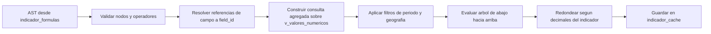

# 07 — Motor de Indicadores y Capa Estadística

## Principio

Un indicador nuevo se define **configurando una fórmula**, nunca escribiendo código.
Las fórmulas se guardan como árbol sintáctico (AST) en JSONB, no como cadenas evaluadas con `eval`.

## Estructura del AST

Nodo base:

```json
{ "op": "<operador>", "args": [ ... ] }
```

### Operadores de agregación

| Operador | Descripción |
|---|---|
| `sum` | Suma de los valores del campo |
| `avg` | Promedio |
| `count` | Cantidad de valores no nulos |
| `count_distinct` | Cantidad de valores distintos |
| `max` | Máximo |
| `min` | Mínimo |

Toman un nodo de referencia y un filtro opcional:

```json
{ "op": "sum", "field": "pacientes_dia", "filter": { "form": "SP11" } }
```

### Operadores aritméticos

| Operador | Descripción |
|---|---|
| `add` | Suma de dos o más nodos |
| `sub` | Resta |
| `mul` | Multiplicación |
| `div` | División con guarda de divisor cero |
| `pct` | `(a / b) × 100` |
| `rate` | `(a / b) × factor`, factor configurable (1000, 10000, 100000) |
| `round` | Redondeo a N decimales |

### Nodos hoja

| Tipo | Ejemplo |
|---|---|
| Campo | `{ "field": "consultas" }` |
| Constante | `{ "const": 100 }` |
| Otro indicador | `{ "indicator": "TOTAL_CONSULTAS" }` |
| Conteo de episodios SP10 | `{ "hosp_count": { "tipo_alta": "FALLECIDO" } }` |

## Ejemplos

Total de consultas médicas:

```json
{ "op": "sum", "field": "consultas", "filter": { "form": "SP1" } }
```

Ocupación hospitalaria:

```json
{
  "op": "pct",
  "args": [
    { "op": "sum", "field": "pacientes_dia",    "filter": { "form": "SP11" } },
    { "op": "sum", "field": "camas_operativas", "filter": { "form": "SP11" } }
  ]
}
```

Tasa de mortalidad hospitalaria por mil egresos:

```json
{
  "op": "rate",
  "factor": 1000,
  "args": [
    { "hosp_count": { "tipo_alta": "FALLECIDO" } },
    { "hosp_count": {} }
  ]
}
```

Porcentaje de cesáreas sobre partos:

```json
{
  "op": "pct",
  "args": [
    { "hosp_count": { "cesarea": true } },
    { "hosp_count": { "servicio": "MATERNIDAD" } }
  ]
}
```

## Filtros disponibles

Aplicables a nivel de nodo o de evaluación completa:

| Filtro | Valores |
|---|---|
| `form` | Código de formulario |
| `periodo_desde` / `periodo_hasta` | `{ anio, mes }` |
| `departamento_id`, `distrito_id`, `establecimiento_id`, `microred_id` | IDs |
| `tipo_establecimiento_id`, `grado_complejidad_id`, `area_gestion_id` | IDs |
| `estado_record` | `enviado` / `aprobado`. Por defecto `aprobado` |
| `field_eq` | `{ "campo": "valor" }` para filtrar por otro campo del mismo registro |

**Todos los filtros de período usan `periodo_anio` / `periodo_mes` (período del dato).**
Nunca `created_at` ni `submitted_at`: filtrar por fecha de digitación produciría cifras erróneas,
porque los datos de enero se cargan en febrero o después.

## Evaluación



Reglas de seguridad:

- Profundidad máxima del árbol: 10 niveles.
- Operadores en lista blanca; cualquier otro produce error de validación.
- Referencias circulares entre indicadores detectadas y rechazadas.
- División por cero devuelve `null`, no error ni infinito.
- El endpoint `validate-formula` verifica el AST antes de persistirlo.

## Caché

Clave: `(indicador_id, periodo_anio, periodo_mes, establecimiento_id)` en `indicador_cache`.

Se invalida cuando:

- un `record` del período cambia de estado o de valores,
- se modifica la fórmula del indicador,
- se recalcula manualmente desde la UI.

Agregaciones de nivel superior (distrito, departamento, país) se calculan desde el caché de establecimiento.

## Capa estadística

Sobre cualquier campo numérico o serie de indicador:

| Medida | Implementación |
|---|---|
| Frecuencia absoluta | `COUNT` por categoría |
| Frecuencia relativa | Proporción sobre el total |
| Porcentaje | Frecuencia relativa por 100 |
| Media | `AVG` |
| Mediana | `PERCENTILE_CONT(0.5)` |
| Moda | `MODE() WITHIN GROUP` |
| Desviación estándar | `STDDEV_SAMP` |
| Varianza | `VAR_SAMP` |
| Cuartiles | `PERCENTILE_CONT` en 0.25, 0.5, 0.75 |
| Percentiles | `PERCENTILE_CONT` con lista configurable |
| Rango | `MAX - MIN` |
| Coeficiente de variación | Desviación estándar sobre media |

PostgreSQL calcula todas las medidas; PHP solo formatea.

### Tendencias

- Serie mensual ordenada por `(periodo_anio, periodo_mes)`.
- Variación absoluta y porcentual respecto al período anterior.
- Media móvil de 3 y 12 períodos.
- Regresión lineal simple para pendiente y proyección del período siguiente.

### Comparaciones

| Comparación | Descripción |
|---|---|
| Mes contra mes anterior | `2026-02` vs `2026-01` |
| Mes contra mismo mes del año anterior | `2026-02` vs `2025-02` |
| Acumulado del año | Suma de enero al mes de corte, contra igual período del año previo |
| Entre establecimientos | Mismo período, ranking y desviación respecto a la media |
| Entre departamentos o distritos | Agregación por nivel geográfico |

### Cortes de análisis

Año, mes, departamento, distrito, establecimiento, microred, tipo de establecimiento,
grado de complejidad, área de gestión, nivel de atención y prestador.

## Datos faltantes

- Un período sin registro **no cuenta como cero**: se excluye del promedio y se reporta como faltante.
- El endpoint devuelve en `meta` la cobertura: períodos y establecimientos esperados contra informados.
- Un indicador con cobertura parcial se marca en el dashboard para no leerse como caída real.
