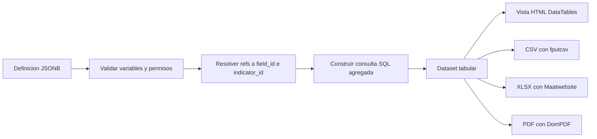

# 08 — Reportes y Dashboards

## Motor de reportes

Un reporte es una **definición JSONB** que se ejecuta contra el motor de datos.

### Estructura de la definición

```json
{
  "fuente": "records",
  "formulario_id": 1,
  "variables": [
    { "tipo": "dimension", "ref": "establecimiento" },
    { "tipo": "dimension", "ref": "periodo" },
    { "tipo": "metrica",   "ref": "field:consultas",     "agg": "sum", "label": "Consultas" },
    { "tipo": "metrica",   "ref": "indicator:OCUPACION", "label": "Ocupación %" }
  ],
  "filtros": {
    "periodo_desde": { "anio": 2026, "mes": 1 },
    "periodo_hasta": { "anio": 2026, "mes": 6 },
    "departamento_id": 7,
    "estado_record": "aprobado"
  },
  "group_by": ["establecimiento", "periodo"],
  "order_by": [{ "ref": "field:consultas", "dir": "desc" }],
  "limit": 500,
  "totales": true
}
```

### Elementos configurables

| Elemento | Opciones |
|---|---|
| Fuente | `records` (agregado) o `hosp_episodios` (nominativo SP10) |
| Dimensiones | departamento, distrito, establecimiento, microred, tipo de establecimiento, grado de complejidad, área de gestión, período, año, mes, ítem de catálogo |
| Métricas | campo con agregación, indicador, conteo de registros |
| Filtros | período, geografía, clasificación, estado del registro, valor de campo |
| Agrupamiento | Cualquier subconjunto de dimensiones |
| Orden | Cualquier variable, ascendente o descendente |
| Totales | Fila de totales y subtotales por grupo |

### Ejecución



### Exportaciones

| Formato | Implementación | Nota |
|---|---|---|
| CSV | `fputcsv` con streaming | BOM UTF-8 para compatibilidad con Excel |
| Excel | `maatwebsite/excel` | Encabezado con logo, período y filtros aplicados |
| PDF | DomPDF | Plantilla Bioestadística con pie de página y fecha de emisión |

Todo export incluye una cabecera con: nombre del reporte, período de los datos,
filtros aplicados, fecha de emisión y usuario que lo generó.
Los reportes de más de 5000 filas se procesan en cola y se notifican al finalizar.

## Dashboards configurables

### Modelo

- **Plantillas institucionales**: `dashboards.user_id = NULL`, administradas por Administrador o Analista.
- **Copias personales**: cada usuario copia una plantilla y la modifica libremente sin afectar la original.

### Tipos de widget

| Tipo | Uso | Configuración clave |
|---|---|---|
| `kpi` | Valor único destacado | métrica, período, comparación opcional |
| `tabla` | Detalle tabular | reporte guardado o definición inline |
| `barras` | Comparación entre categorías | dimensión, métrica |
| `lineas` | Evolución temporal | métrica, rango de períodos |
| `pastel` | Composición | dimensión, métrica |
| `heatmap` | Cruce de dos dimensiones | dimensión X, dimensión Y, métrica |
| `indicador` | Indicador con meta y semáforo | indicador, umbrales |

### Configuración de un widget

```json
{
  "tipo": "lineas",
  "titulo": "Consultas médicas 2026",
  "query_config": {
    "metrica": { "ref": "field:consultas", "agg": "sum" },
    "dimension": "periodo",
    "filtros": {
      "formulario_id": 1,
      "periodo_desde": { "anio": 2026, "mes": 1 },
      "periodo_hasta": { "anio": 2026, "mes": 12 },
      "departamento_id": 7
    },
    "chart": { "stacked": false, "show_legend": true }
  },
  "pos_x": 0, "pos_y": 0, "ancho": 6, "alto": 4
}
```

Widget KPI con semáforo:

```json
{
  "tipo": "indicador",
  "titulo": "Ocupación hospitalaria",
  "query_config": {
    "indicador": "OCUPACION_HOSPITALARIA",
    "periodo": "ultimo_cerrado",
    "umbrales": { "verde": [70, 85], "amarillo": [85, 95], "rojo": [95, 999] },
    "comparar_con": "mes_anterior"
  }
}
```

### Frontend

Chart.js 3.9, mismo patrón que SIESS. El backend devuelve series ya calculadas:

```json
{
  "data": {
    "labels": ["01/2026", "02/2026", "03/2026"],
    "datasets": [ { "label": "Consultas", "data": [3400, 3120, 3580] } ]
  },
  "meta": { "unidad": "consultas", "cobertura": "128 de 140 establecimientos" }
}
```

El frontend no calcula agregados: solo dibuja. Esto mantiene una sola fuente de verdad
para las cifras entre dashboard, reporte y export.

### Layout

Grilla de 12 columnas. Cada widget guarda `pos_x`, `pos_y`, `ancho`, `alto`.
El reordenamiento por arrastre persiste con `POST /dashboards/{id}/layout`.

### Rendimiento

- Los widgets consultan `indicador_cache` cuando la métrica es un indicador.
- Caché de respuesta por widget con TTL configurable, invalidada al aprobarse registros del período.
- Carga asíncrona: la vista renderiza los contenedores y cada widget pide sus datos por separado.

### Etiqueta de período

Todo widget muestra explícitamente el período de los datos ("Enero 2026"), no la fecha de consulta.
Dado que la carga es diferida, el dashboard también indica el último período cerrado disponible
y el porcentaje de establecimientos que ya informaron.
