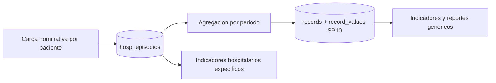

# 09 — Hospitalización SP10 (módulo híbrido)

## Por qué es especial

Las demás planillas son **agregadas**: una fila por prestación con columnas de conteo.
SP10 es **nominativa**: una fila por paciente egresado. Guardarla en el modelo EAV genérico
haría imposible calcular estancia media, mortalidad o porcentaje de cesáreas con precisión.

Solución híbrida: tabla dedicada `hosp_episodios` para el detalle nominativo,
más agregación automática hacia el motor genérico para que SP10 aparezca junto al resto.

## Campos del episodio

| Campo | Tipo | Nota |
|---|---|---|
| `cedula` | varchar | Identificación del paciente |
| `sexo` | varchar(1) | M / F |
| `seguro` | varchar | IPS, sin seguro, otro |
| `edad` | integer | Al ingreso |
| `fecha_ingreso` | date | Obligatoria |
| `fecha_egreso` | date | Nula mientras el paciente sigue internado |
| `servicio` | varchar | Clínica médica, cirugía, maternidad, UTI, pediatría |
| `diagnostico` | varchar | Descripción |
| `cie10` | varchar(10) | Código CIE-10 |
| `tipo_alta` | varchar | Mejorado, curado, traslado, fallecido, retiro voluntario |
| `cirugia` | boolean | Si tuvo intervención |
| `tipo_cirugia` | varchar | Mayor, menor, alta complejidad |
| `recien_nacido` | boolean | Nacimiento en el establecimiento |
| `cesarea` | boolean | Parto por cesárea |
| `establecimiento_id` | FK | A `bioestadistica.establecimientos` |
| `periodo_anio`, `periodo_mes` | smallint | Período estadístico del egreso |
| `record_id` | FK nullable | Registro SP10 agregado al que contribuye |

Restricciones: `fecha_egreso >= fecha_ingreso`, `sexo` en M o F, `periodo_mes` entre 1 y 12.

## Protección de datos personales

La cédula es dato identificable. Reglas:

- Solo roles con permiso `bio.hosp.view_pii` ven la cédula completa; el resto ve los últimos dígitos enmascarados.
- Los reportes y dashboards agregados nunca exponen cédula.
- Toda lectura del detalle nominativo queda registrada en `audit_log`.
- Los exports con datos nominativos requieren permiso explícito `bio.hosp.export`.

## Indicadores hospitalarios

| Indicador | Fórmula |
|---|---|
| Egresos | Conteo de episodios con `fecha_egreso` en el período |
| Ingresos | Conteo de episodios con `fecha_ingreso` en el período |
| Días de estancia | Suma de `fecha_egreso - fecha_ingreso` |
| Estancia media | Días de estancia sobre egresos |
| Mortalidad hospitalaria | Egresos con `tipo_alta = FALLECIDO` sobre egresos, por 100 |
| Tasa de mortalidad por mil | Igual, por 1000 |
| Cirugías | Conteo con `cirugia = true` |
| Cesáreas | Conteo con `cesarea = true` |
| Porcentaje de cesáreas | Cesáreas sobre partos del servicio maternidad, por 100 |
| Recién nacidos | Conteo con `recien_nacido = true` |
| Ocupación hospitalaria | Pacientes día sobre camas operativas, por 100 (usa SP11) |
| Índice de rotación de camas | Egresos sobre camas operativas |
| Intervalo de sustitución | Camas disponibles menos pacientes día, sobre egresos |

### Cálculo de estancia

- El día de ingreso cuenta; el de egreso no (convención de días-cama).
- Estancia mínima registrada de un día para ingreso y egreso el mismo día.
- Los episodios sin `fecha_egreso` se excluyen del cálculo de estancia media
  pero se cuentan como pacientes en cama al cierre del período.

### Origen de camas operativas

Las camas operativas **no son atributo del establecimiento**: varían mes a mes.
Se capturan en SP11 (matriz de paciente día) como dato de planilla del período.
Los indicadores de ocupación y rotación combinan `hosp_episodios` con los valores de SP11
del mismo establecimiento y período.

## Agregación al motor genérico

Al cerrar el período, `HospitalizationService` genera o actualiza el `record` SP10 correspondiente:

| Campo agregado | Origen |
|---|---|
| `egresos_total` | Conteo de egresos |
| `egresos_por_servicio` | Conteo agrupado por servicio (JSONB) |
| `egresos_por_sexo` | Conteo agrupado por sexo |
| `dias_estancia` | Suma de días |
| `fallecidos` | Conteo por tipo de alta |
| `cirugias`, `cesareas`, `recien_nacidos` | Conteos booleanos |

Así SP10 participa de reportes, dashboards y comparaciones igual que las planillas agregadas,
sin duplicar la fuente de verdad: el detalle nominativo siempre manda.

## Reglas operativas

1. Un episodio pertenece a un solo establecimiento y a un solo período estadístico.
2. El período del episodio se determina por la fecha de egreso; si aún no hay egreso, por la de ingreso.
3. Un traslado genera un egreso en el establecimiento de origen y un ingreso en el de destino.
4. La reapertura de un período recalcula la agregación y registra el cambio en `audit_log`.
5. La carga puede ser manual, registro por registro, o por importación Excel de la planilla SP10.

## Interfaz

- Listado con DataTables filtrable por establecimiento, período, servicio y tipo de alta.
- Formulario de alta y edición con validación de fechas y búsqueda de CIE-10 desde catálogo.
- Panel de indicadores hospitalarios del período con comparación contra el mes anterior.
- Botón de consolidación que dispara la agregación al registro SP10.
