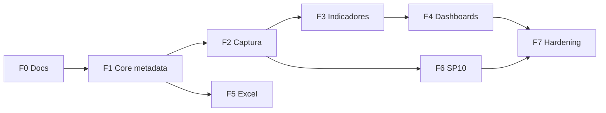

# 11 — Roadmap de Implementación

## Resumen de fases

| Fase | Alcance | Resultado verificable |
|---|---|---|
| **F0** Documentación | Modelo funcional, arquitectura, ER, DDL, contrato de API, análisis de fuentes | Carpeta `docs/bioestadistica/` completa |
| **F1** Core metadata | Migraciones, geografía, lookups, CRUD de metadata, seeders, menú y roles | Constructor de formularios operativo con ~140 establecimientos cargados |
| **F2** Captura | `records` / `record_values`, validaciones, flujo de estados | Carga de SP configuradas con período obligatorio |
| **F3** Indicadores y estadística | Motor AST, capa estadística, endpoints | Totales y ocupación hospitalaria sin escribir código |
| **F4** Dashboards y reportes | Widgets Chart.js, diseñador de reportes, exports | Tableros y salidas PDF / Excel / CSV |
| **F5** Importación Excel | Wizard genérico e importadores dedicados | Re-importación de los tres Excel de `.docs-bio/` |
| **F6** Hospitalización SP10 | `hosp_episodios` e indicadores hospitalarios | Estancia media, mortalidad, cesáreas |
| **F7** Auditoría y hardening | `audit_log` con UI, permisos finos, pruebas | Listo para producción |

## F0 — Documentación (completada)

Entregables en `docs/bioestadistica/`:

- Modelo funcional, arquitectura Clean, modelo de datos y diagrama ER
- DDL de referencia del schema `bioestadistica`
- Contrato de API REST `/api/bio/v1`
- Especificación de importación Excel, motor de indicadores, reportes, dashboards, SP10, seguridad
- Análisis de las tres fuentes Excel y del sistema Access legado
- Enlace desde `ROADMAP.md`

Criterio de cierre: la Fase 1 puede implementarse sin volver a consultar los archivos fuente.

## F1 — Core metadata

| Paso | Detalle |
|---|---|
| 1 | Migración `CREATE SCHEMA bioestadistica` |
| 2 | Migraciones de geografía: `departamentos`, `distritos`, `microredes`, `tipos_establecimiento`, `grados_complejidad`, `areas_gestion`, `establecimientos` |
| 3 | Migraciones de metadata: `catalogos`, `catalog_items`, `variable_definitions`, `formularios`, `form_secciones`, `fields` |
| 4 | Modelos Eloquent con relaciones y scopes |
| 5 | Instalación de `maatwebsite/excel` |
| 6 | Seeder de departamentos y distritos paraguayos desde `codigo distrito.xlsx` |
| 7 | Seeder de establecimientos desde `ESTABLECIMIENTO_CON_ID.xlsx` |
| 8 | Seeder de variables y catálogos desde `variables salud.xls` |
| 9 | CRUD Blade de geografía, lookups, catálogos y formularios con DataTables |
| 10 | Constructor de campos con vista previa |
| 11 | Selectores en cascada departamento → distrito → establecimiento |
| 12 | Seeder de roles y permisos nuevos; bloques de menú en el sidebar |

Criterios de aceptación:

- Los ~140 establecimientos quedan cargados con su clasificación.
- Se puede crear un formulario nuevo con secciones y campos, y publicarlo, desde la UI.
- Los catálogos de prestaciones quedan disponibles para los campos de tipo tabla.

## F2 — Captura

**Estado: implementado**. Incluye la migración EAV, índice único parcial por período
(`WHERE deleted_at IS NULL`), el servicio de persistencia y validación en servidor,
interfaz de inicio/listado/edición, panel de períodos pendientes, asignación de
establecimientos al Digitador y el circuito borrador → enviado → aprobado/objetado.
Consultor y Auditor ven todos los registros; el Digitador queda limitado a sus
establecimientos asignados.

**SP1 queda como piloto configurado y publicado**: sección de consultas por especialidad
con un campo `tabla` sobre el catálogo `VAR_1_CONSULTA_POR_ESPECIALIDAD` (58 especialidades),
columna `total_consultas` con mínimo 0, totales en vivo y una sección de observaciones.
El editor tabular real ya está implementado; los valores se guardan como
`{"rows": {"<catalog_item_id>": {"<columna>": número}}}` descartando filas vacías.
Subtabla y matriz siguen con editor JSON hasta importar SP8 y SP11.

| Paso | Detalle |
|---|---|
| 1 | Migraciones `records` y `record_values` con la restricción única de período |
| 2 | `RecordCaptureService` con validación por tipo de campo |
| 3 | Renderizador dinámico de formularios según `layout_type` |
| 4 | Sección de contexto con departamento, distrito, establecimiento, mes y año |
| 5 | Flujo de estados: borrador, enviado, aprobado, objetado |
| 6 | Alcance por establecimiento para el rol Digitador |
| 7 | Panel de períodos pendientes por establecimiento |

Criterios de aceptación:

- Cargar SP1 de enero en febrero funciona y queda registrado con `periodo_mes = 1`.
- Un segundo intento de cargar el mismo formulario, establecimiento y período es rechazado.
- Las validaciones de obligatorio, mínimo, máximo y regex se aplican en servidor.

## F3 — Indicadores y estadística

| Paso | Detalle |
|---|---|
| 1 | Migraciones `indicadores`, `indicador_formulas`, `indicador_cache` |
| 2 | Vistas `v_valores_numericos` y `v_establecimientos_geo` |
| 3 | `FormulaEvaluator` con lista blanca de operadores y validación de AST |
| 4 | `IndicatorEngine` con filtros de período y geografía |
| 5 | `StatisticsEngine` sobre funciones nativas de PostgreSQL |
| 6 | Constructor visual de fórmulas |
| 7 | Caché con invalidación al aprobarse registros |

Criterios de aceptación:

- Total de consultas y ocupación hospitalaria se definen solo configurando.
- Los filtros de período usan el período del dato, nunca la fecha de carga.
- Una fórmula circular o con operador desconocido es rechazada antes de guardarse.

## F4 — Dashboards y reportes

| Paso | Detalle |
|---|---|
| 1 | Migraciones `reportes`, `dashboards`, `dashboard_widgets` |
| 2 | `ReportBuilder` y ejecución de definiciones |
| 3 | Exportadores CSV, XLSX y PDF con cabecera de período y filtros |
| 4 | Diseñador de reportes en la UI |
| 5 | `DashboardService` y constructores de payload Chart.js |
| 6 | Grilla de widgets con arrastre y persistencia de layout |
| 7 | Copia personal de plantillas institucionales |

Criterios de aceptación:

- Un reporte se define, guarda y exporta en los tres formatos.
- Los widgets muestran el período de los datos y la cobertura de establecimientos.
- Las cifras del dashboard, el reporte y el export coinciden.

## F5 — Importación Excel

| Paso | Detalle |
|---|---|
| 1 | Migración `import_jobs` |
| 2 | Wizard de subida, análisis y previsualización |
| 3 | Inferencia de tipos y sugerencia de catálogos |
| 4 | Pantalla de mapeo confirmable |
| 5 | Importadores dedicados de variables, establecimientos y formularios SP |
| 6 | Matching asistido de prestaciones |
| 7 | Segunda pasada de carga de datos con período obligatorio |

Criterios de aceptación:

- Los tres Excel se reimportan de forma idempotente, sin duplicar catálogos.
- Un Excel arbitrario genera un formulario dinámico válido.
- Cada corrida deja resumen y traza de auditoría.

## F6 — Hospitalización SP10

| Paso | Detalle |
|---|---|
| 1 | Migración `hosp_episodios` |
| 2 | CRUD nominativo con validación de fechas y CIE-10 |
| 3 | Enmascaramiento de cédula según permiso |
| 4 | Indicadores hospitalarios |
| 5 | Consolidación al registro agregado SP10 |
| 6 | Panel hospitalario con comparación entre períodos |

Criterios de aceptación:

- Estancia media, mortalidad, cirugías y cesáreas se calculan desde el detalle nominativo.
- La ocupación combina episodios con las camas operativas informadas en SP11.
- Sin `bio.hosp.view_pii` la cédula aparece enmascarada.

## F7 — Auditoría y hardening

| Paso | Detalle |
|---|---|
| 1 | Migración `audit_log` y trait `Auditable` |
| 2 | Observers en modelos de metadata, registros y episodios |
| 3 | UI de consulta con comparación de valores |
| 4 | Revisión de permisos por ruta y policies contextuales |
| 5 | Redirección post-login del rol Analista |
| 6 | Pruebas de feature de los flujos críticos |
| 7 | Índices, planes de consulta y ajuste de caché |

Criterios de aceptación:

- Todo cambio de metadata y de dato queda con valor anterior y valor nuevo.
- Ninguna ruta del módulo queda sin verificación de permiso.
- Cero cambios funcionales en SIESS, RIISS y PEI.

## Dependencias entre fases

F5 depende solo de F1 y puede desarrollarse en paralelo con F2 y F3.

## Criterios de aceptación globales

1. Crear SP15 desde la UI o por importación, **sin migración de negocio nueva**.
2. Definir un indicador nuevo solo configurando su AST.
3. Ninguna tabla `sp1` a `sp14`.
4. Cero FK, joins o dependencias hacia RIISS, SIESS o PEI.
5. El maestro de establecimientos vive completo en `bioestadistica.*`.
6. Jerarquía departamento, distrito, establecimiento respetada; el departamento se deriva del distrito.
7. Cada carga identifica el mes y año del dato, independiente de la fecha de digitación.
8. Los números entre paréntesis de las planillas SP se ignoran (legado Access).
9. `npm run dev` no sobrescribe el CSS de Material Dashboard (salida en `mix.css`).
