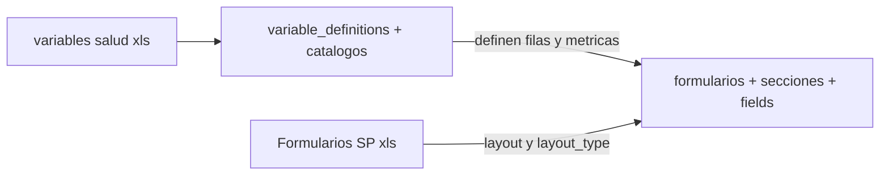
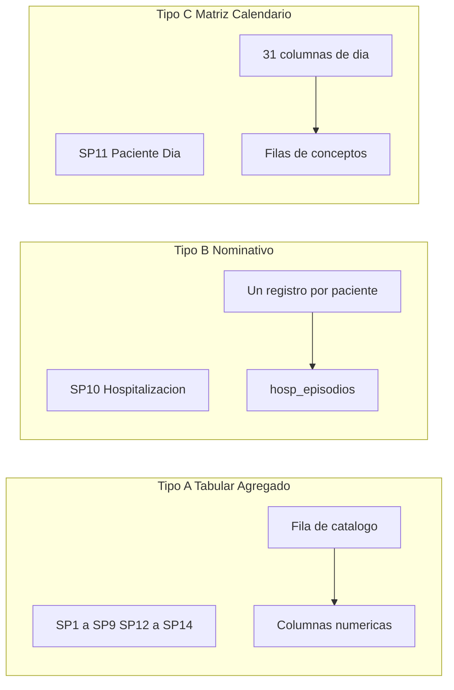

# 12 — Análisis de Planillas SP y Variables

Fuentes en `.docs-bio/` (carpeta gitignored):

| Archivo | Contenido | Hojas |
|---|---|---|
| `Formularios SP.xls` | Layout y captura de cada planilla SP | 14, una por formulario |
| `variables salud.xls` | Diccionario de dominios, tipos de registro y prestaciones | 2: `VARIABLES SALUD (2)` canónica y `VARIABLES SALUD` (borrador, no usar) |

## Relación entre los dos archivos

`variables salud.xls` **define** qué se mide; `Formularios SP.xls` define **cómo se captura**.



El vínculo es por **contenido**: los nombres de especialidades, determinaciones, vacunas y procedimientos
de las planillas corresponden a prestaciones del diccionario.

**Los números entre paréntesis de las planillas SP se ignoran.** Eran identificadores del registro
Access legado y no cumplen ninguna función en el motor metadata-driven.

## Inventario de formularios

| Código | Nombre | Tipo de captura | Periodicidad | Contenido principal |
|---|---|---|---|---|
| SP1 | Consultas Médicas | Tabular agregado | Mensual | Especialidades y métricas de consultas |
| SP2 | Enfermería | Tabular agregado | Mensual | Servicios de enfermería y totales |
| SP3 | Estudios Baja Complejidad | Tabular agregado | Mensual | Métodos diagnósticos, pacientes, estudios |
| SP4 | Estudios Alta Complejidad | Tabular agregado | Mensual | Métodos de alta complejidad, pacientes, estudios |
| SP5 | Laboratorio | Tabular agregado | Mensual | Determinaciones, pacientes, totales |
| SP6 | Odontología | Tabular agregado | Mensual | Pacientes y prestaciones odontológicas |
| SP7 | Procedimientos | Tabular agregado | Mensual | Procedimientos, pacientes, prestaciones |
| SP8 | Vacunación | Tabular cruzado | Mensual | Vacunas por sexo y grupo etario |
| SP9 | Urgencias | Tabular agregado | Mensual | Consultas, observación, procedimientos |
| SP10 | Hospitalización | **Nominativo por paciente** | Mensual | Cédula, sexo, fechas, CIE-10, tipo de alta, recién nacido |
| SP11 | Paciente Día | **Matriz calendario de 31 días** | **Diaria dentro del mes** | Ingresos, egresos, paciente día, camas por día |
| SP12 | VIH y Tuberculosis | Tabular agregado | Mensual | Programas de epidemiología |
| SP13 | Programas de Salud | Tabular extenso | Mensual | Salud sexual y reproductiva, diabetes, TB, nutrición, VIH |
| SP14 | Medicamentos e Insumos | Tabular dual | Mensual | Insumos y medicamentos prescritos |

**Nota SP2**: la hoja del Excel está nombrada "SP3 - ENFERMERIA" pero su título interno dice "TABLA SP 2".
El importador normaliza el código a `SP2`.

## Encabezado común

Todas las planillas, con SP11 como excepción parcial, comparten el mismo encabezado:

- Departamento
- Establecimiento
- Código del establecimiento
- Planilla estadística del mes
- Año

En el motor, este encabezado **no genera campos**: se resuelve con la sección de contexto de la UI
y con las columnas de `records` (`establecimiento_id`, `periodo_anio`, `periodo_mes`).

### Período del dato contra fecha de carga

La digitación ocurre en el mes siguiente o posterior al período reportado.

| Concepto | Campo | Ejemplo |
|---|---|---|
| Período estadístico | `periodo_anio`, `periodo_mes` | 2026, 1 (enero) |
| Momento de la carga | `created_at`, `submitted_at` | 2026-02-15 |

Unicidad de captura: `(formulario_id, establecimiento_id, periodo_anio, periodo_mes)`.

Consecuencia para indicadores y reportes: **todos los filtros temporales usan el período del dato**.
Filtrar por fecha de digitación mostraría enero recién en febrero y distorsionaría toda serie temporal.

## Tres patrones de formulario



### Tipo A — Tabular agregado

La mayoría de las planillas. Filas provenientes de un catálogo y columnas métricas numéricas.
Se modela con un campo de tipo `tabla`:

```json
{
  "type": "tabla",
  "config": {
    "row_catalog_id": 12,
    "columns": [
      { "code": "pacientes", "label": "Pacientes", "type": "integer", "min": 0 },
      { "code": "prestaciones", "label": "Prestaciones", "type": "integer", "min": 0 }
    ]
  }
}
```

SP8 es una variante cruzada: las columnas son la combinación de sexo por grupo etario.
Se modela igual, con las columnas expandidas en la configuración.

### Tipo B — Nominativo (SP10)

Cada fila es un paciente. Va a `hosp_episodios`, no al modelo EAV.
Ver [09-hospitalizacion-sp10.md](09-hospitalizacion-sp10.md).

### Tipo C — Matriz calendario (SP11)

Filas de conceptos (ingresos, egresos, óbitos, paciente día, camas disponibles, camas operativas)
por 31 columnas de día más total. Se modela con un campo de tipo `matriz`:

```json
{
  "type": "matriz",
  "config": {
    "rows": ["ingresos", "egresos", "obitos", "pacientes_dia", "camas_disponibles", "camas_operativas"],
    "cols": "dias_mes",
    "col_count": 31,
    "totals": true
  }
}
```

Las **camas operativas** se capturan aquí, como dato mensual de planilla.
Por eso no son un atributo del maestro de establecimientos: varían de mes a mes.

## Diccionario de variables

Estructura jerárquica de cuatro columnas:

```
CODIGO DE VARIABLE → DESCRIPCION DE VARIABLE → TIPO DE REGISTRO → PRESTACIONES
```

Hoja canónica: `VARIABLES SALUD (2)` (headers en fila 1). Volumen: **553 filas de prestación** (551 combinaciones únicas) en **94 tipos de registro** y **18 dominios**. No existe el código de dominio `6`. El duplicado `RUBEOLA IGG` se omite en el seeder.

| Código | Dominio | Ejemplos de tipo de registro |
|---|---|---|
| 1 | Ambulatorio | Consulta por especialidad (58 ítems) |
| 2 | Hospitalización | Egresos, internación, interconsultas |
| 3 | Maternidad | Nacimientos, emergencias obstétricas |
| 4 | Urgencias | Adultos, pediátricas, convenio |
| 5 | Cirugía | Alta complejidad, mayor, menor |
| 7 | UTI | Unidad de terapia intensiva |
| 8 | Diálisis | Hemodiálisis, diálisis peritoneal |
| 10 | Laboratorio | 154 determinaciones clínicas |
| 11 | Estudios de alta complejidad | TAC, RMN, endoscopía |
| 12 | Estudios de baja complejidad | Ecografía, radiografía, audiometría |
| 13 | Enfermería | Curaciones, signos vitales, medicación |
| 14 | Procedimientos | Odontología, banco de sangre, planificación familiar |
| 15 | Preventivas | Charlas educativas, actividades socio-sanitarias |
| 16 | Vacunación | Clasificación de vacuna y beneficiarios |
| 17 | Programas de salud | SSR, diabetes, TB, nutrición, VIH |
| 18 | Apoyo y servicios | Limpieza, lavandería, ambulancias |

El código `x` corresponde a medicamentos e insumos.

Las celdas del Excel vienen con valores heredados por combinación o vacío: el importador propaga
el último valor no vacío hacia abajo antes de procesar.

## Mapeo a la base de datos

| Origen | Destino |
|---|---|
| Dominio (código y descripción) | `variable_definitions.codigo_dominio`, `.dominio` |
| Tipo de registro | `variable_definitions.tipo_registro` y un `catalogos` por dominio y tipo |
| Prestación | `variable_definitions.prestacion` y un `catalog_items` |
| Hoja SP | Una fila en `formularios` |
| Bloque de la planilla | `form_secciones` |
| Fila de prestación | `catalog_items` referenciado por el campo tabla |
| Columna métrica | Columna dentro de `fields.config.columns` |
| Encabezado de la planilla | Columnas de `records`, no campos |

## Implicaciones de diseño

1. Se agrega el tipo de campo `matriz`, además de `tabla` y `subtabla`.
2. `formularios.layout_type` con valores `tabular`, `nominativo` y `matriz`.
3. `variable_definitions` es la tabla puente entre el diccionario y los campos.
4. Todo `record` lleva `periodo_anio` y `periodo_mes`; la fecha de digitación es metadata de auditoría.
5. Orden de carga en los seeders e importadores: variables, establecimientos, formularios.
6. SP2 se normaliza pese al nombre de la hoja.
7. Las camas operativas son dato de SP11, no atributo del establecimiento.
8. Agregar una prestación nueva no requiere cambios de DDL.
