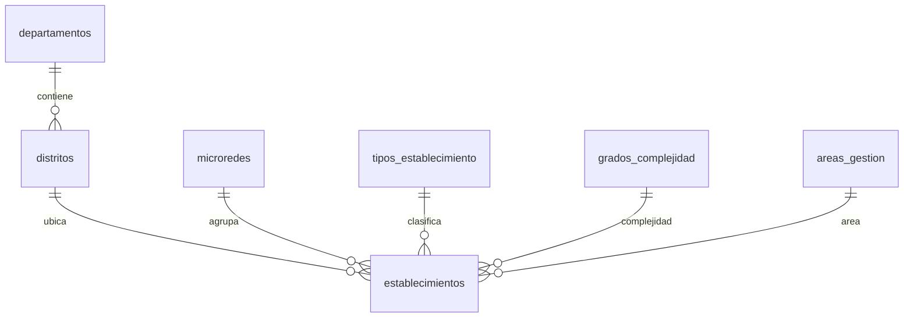

# 13 — Maestro de Establecimientos

Fuentes:

- `.docs-bio/ESTABLECIMIENTO_CON_ID.xlsx`: maestro histórico cargado en base.
- `.docs-bio/ESTABLECIMIENTO_CON_ID 2.xlsx`: definición actual de las **17 columnas del ABM**, agrega `DISTRITO`.

Al 14/08/2026 el archivo `ESTABLECIMIENTO_CON_ID 2.xlsx` contiene solo 2 filas de datos.
Por seguridad, el seeder no reemplaza el maestro de 140 registros hasta que el archivo tenga al menos 100 filas útiles.

| Hoja | Contenido |
|---|---|
| `DIM ESTABLECIMIENTOS` | 140 filas de establecimientos IPS |
| `CODIGO SIH` | Cruce de código SIH con el sistema (SIH / SAMIW) |

## Columnas del ABM

El alta, edición y listado exponen las columnas del archivo 2. Las dimensiones normalizadas se
seleccionan por FK y se presentan con su etiqueta:

`ID_ESTABLECIMIENTO`, `ESTABLECIMIENTO`, `Código sih`, `Tipo de Establecimiento`,
`Nivel de Atención`, `Grado de Complejidad`, `COMPLEJIDAD Descripcion`, `DEPARTAMENTO`,
`DISTRITO`, `MICRORED`, `PRESTADOR`, `id_DEPTO`, `LATITUD`, `LONGITUD`,
`AREA DE GESTIÓN`, `SITUACION INMUEBLE`, `OBSERVACIÓN`.

`DEPARTAMENTO` e `id_DEPTO` se derivan del distrito seleccionado. Grado y descripción forman
una clave compuesta en `grados_complejidad`, porque un mismo código puede tener más de una descripción.

## Decisión de aislamiento

El maestro geográfico de Bioestadística es **propio y completo**: vive en `bioestadistica.*`
y no lee ni escribe `public.establecimientos` de RIISS, ni `localities`, ni ninguna tabla de otro schema.

Motivo: los módulos existentes tienen su propia semántica de establecimiento y ciclo de vida.
Compartir la tabla acoplaría los módulos y haría que un cambio en RIISS rompa la estadística sanitaria.

## Jerarquía geográfica

```
Departamento  →  Distrito  →  Establecimiento
   Itapúa      →  Hohenau   →  Hospital Hohenau
   Itapúa      →  Fram      →  Puesto Sanitario Fram
```

Reglas:

1. Un distrito pertenece **siempre** a un departamento.
2. Un establecimiento pertenece **siempre** a un distrito, y por transitividad a su departamento.
3. `establecimientos` guarda solo `distrito_id`. **El departamento no se duplica**: se lee vía distrito.
4. En la captura de planillas, los selectores funcionan en cascada:
   departamento, luego distrito filtrado, luego establecimiento filtrado.



## El Excel de establecimientos no trae distrito

Hallazgo: la hoja `DIM ESTABLECIMIENTOS` trae departamento (`DEPARTAMENTO` y `id_DEPTO`)
pero **no incluye una columna de distrito**.

Fuente del catálogo: `.docs-bio/codigo distrito.xlsx` (hoja `codigo_distrito_maspbs`).

| Columna | Uso |
|---|---|
| `ID_DPTO` | FK a `departamentos.codigo` |
| `ID_DISTRITO` | `distritos.codigo` (único dentro del departamento) |
| `DENOMINACIÓN` | `distritos.nombre` |
| `DEPARTAMENTO` | Etiqueta auxiliar (`07 - ITAPUA`); se ignora el código 50 EXTRANJERO |

Estrategia de completado:

| Vía | Detalle |
|---|---|
| 1 | Seeder `BioestadisticaDistritosSeeder` carga ~249 distritos paraguayos (omite EXTRANJERO) |
| 2 | Asignación asistida: si el nombre del establecimiento contiene el del distrito del mismo departamento (ej. Hohenau, Fram), se enlaza automáticamente |
| 3 | Asignación manual desde el CRUD para los casos restantes |

Durante el seed inicial algunos `distrito_id` pueden quedar `NULL`.
En la operación de captura de planillas el distrito es **obligatorio**.

La base Access legada también tiene distrito (`Cod_Distr`), lo que confirma la jerarquía. Ver [14-legado-access.md](14-legado-access.md).

## Normalización de columnas

| Columna Excel | Destino | Tipo de destino |
|---|---|---|
| `id_DEPTO` + `DEPARTAMENTO` | `departamentos` | **Tabla** — 18 códigos |
| *(no está en el Excel)* | `distritos` | **Tabla** — FK a departamento |
| `MICRORED` | `microredes` | **Tabla** |
| `Tipo de Establecimiento` | `tipos_establecimiento` | **Tabla** |
| `Grado de Complejidad` + `COMPLEJIDAD Descripcion` | `grados_complejidad` | **Tabla** — código y descripción |
| `AREA DE GESTIÓN` | `areas_gestion` | **Tabla** |
| `Nivel de Atención` | `establecimientos.nivel_atencion` | **Campo** — NIVEL 1 a 4 |
| `PRESTADOR` | `establecimientos.prestador` | **Campo** — IPS / CONVENIO / TERCERIZADO |
| `SITUACION INMUEBLE` | `establecimientos.situacion_inmueble` | **Campo** |
| `SISTEMA` (hoja `CODIGO SIH`) | `establecimientos.sistema` | **Campo** — SIH / SAMIW |
| `ID_ESTABLECIMIENTO` | `establecimientos.codigo` | Campo único |
| `ESTABLECIMIENTO` | `establecimientos.nombre` | Campo |
| `Código sih` | `establecimientos.codigo_sih` | Campo |
| `LATITUD` / `LONGITUD` | `latitud`, `longitud` | Campo numérico (coma decimal; coords inválidas → `NULL`) |
| `OBSERVACIÓN` | `observacion` | Campo texto |

### Por qué unas son tablas y otras campos

Son **tablas** las columnas que necesitan administración propia: agrupan establecimientos,
sirven de dimensión de análisis y su lista cambia con el tiempo (microredes, tipos, grados, áreas).

Son **campos** las columnas de dominio corto y estable que solo describen al establecimiento
y no requieren un CRUD aparte: nivel de atención, prestador, situación del inmueble y sistema.

## Ajustes solicitados y aplicados

| Ajuste | Estado |
|---|---|
| Unificar Tipología-Clasificación dentro de Tipo de Establecimiento | Aplicado. `tipos_establecimiento` absorbe ambos; la columna vieja se ignora al importar |
| Nivel de Atención deja de ser tabla | Aplicado. Campo `nivel_atencion` |
| Prestador deja de ser tabla | Aplicado. Campo `prestador` |
| Situación del inmueble deja de ser tabla | Aplicado. Campo `situacion_inmueble` |
| `sistemas_codigo` deja de ser tabla | Aplicado. Campo `sistema` |
| Quitar `camas_operativas` del maestro | Aplicado. Se captura en SP11 como dato mensual |
| Quitar `activo` del maestro | Aplicado. El estado se maneja con `deleted_at` |
| Incorporar distrito como nivel intermedio | Aplicado. Tabla `distritos` entre departamento y establecimiento |

## Estructura final de `establecimientos`

| Campo | Tipo | Nota |
|---|---|---|
| `codigo` | varchar único | `ID_ESTABLECIMIENTO` |
| `nombre` | varchar | |
| `distrito_id` | FK nullable | Obligatorio en captura |
| `microred_id` | FK nullable | |
| `tipo_establecimiento_id` | FK nullable | |
| `grado_complejidad_id` | FK nullable | |
| `area_gestion_id` | FK nullable | |
| `nivel_atencion` | varchar | |
| `prestador` | varchar | |
| `situacion_inmueble` | varchar | |
| `sistema` | varchar | |
| `codigo_sih` | varchar | |
| `latitud`, `longitud` | numeric | |
| `observacion` | text | |

## Consideraciones de carga

| Caso | Tratamiento |
|---|---|
| Asunción y Capital | Se unifican bajo el código de departamento 18 |
| Tipología-clasificación duplicada | Se ignora si aparece; ya está unificada |
| `Código sih` sin correspondencia en la hoja `CODIGO SIH` | `sistema` queda nulo |
| Establecimiento sin distrito identificable | `distrito_id` nulo, pendiente de asignación |
| Reimportación | Upsert por `codigo`, idempotente |
| Hoja `CODIGO SIH` | Cruce por `Código`; solo 31 de 140 establecimientos DIM tienen código SIH. No se crean establecimientos desde esa hoja |
| Coordenadas corruptas | Tres filas con notación científica se normalizan o quedan nulas |

## Vista de apoyo

`bioestadistica.v_establecimientos_geo` resuelve la jerarquía completa en una sola lectura:
establecimiento con su distrito, departamento, microred, tipo, grado de complejidad y área de gestión.
La usan los reportes, dashboards y filtros geográficos de indicadores.

## Uso como dimensión de análisis

Los cortes disponibles en indicadores y reportes:

departamento, distrito, establecimiento, microred, tipo de establecimiento,
grado de complejidad, área de gestión, nivel de atención y prestador.
