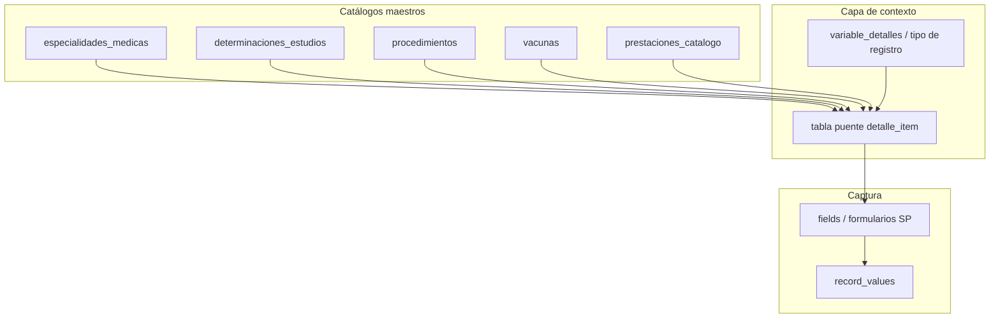

# 16 — Catálogos maestros y diccionario de variables

## Objetivo

Reorganizar el diccionario de variables (`variables salud.xlsx`) en **catálogos maestros reutilizables**, separados del **tipo de registro** (contexto de captura), sin duplicar innecesariamente especialidades, vacunas y determinaciones.

Este documento fija el **diseño funcional y de datos** acordado. **No implica cambios de código** hasta una fase de implementación explícita.

## Fuente canónica

| Archivo | Ubicación | Notas |
|---|---|---|
| `variables salud.xlsx` | `.docs-bio/` (gitignored) | Hoja `VARIABLES SALUD`, **623 filas** de prestación (sep. 2026) |
| `Formularios SP.xls` | `.docs-bio/` | Layout de captura SP1–SP14 |

Reemplaza como referencia operativa al antiguo `variables salud.xls` (553 filas) para el diseño de catálogos.

Convenciones de marcado en la planilla:

| Color | Significado |
|---|---|
| **Amarillo** (`FFFF00`) | **Columnas** del formulario (SP8, SP9), no filas de catálogo |
| **Naranja** (`FFC000`) | Filas del dominio `x` — análisis funcional pendiente; por ahora van a `prestaciones_catalogo` |

---

## Problema que resuelve

Hoy el diccionario es una cadena plana:

```
Variable (dominio) → VariableDetalle (tipo de registro) → Prestacion (fila)
```

Limitaciones:

1. **Espejos** (convenio, interconsulta, teleconsulta, urgencia) duplicarían nombres de especialidad en muchas filas.
2. **Homónimos** con distinto significado (ej. Odontología consulta vs procedimiento odontológico SP6).
3. **SP8 y SP9** mezclan en el Excel filas que son **catálogo**, **columnas** o **métricas agregadas**.
4. Mantenimiento costoso: agregar Cardiología implicaría repetir en cada tipo de registro.

---

## Solución: cinco catálogos maestros

| Catálogo | Contenido | Volumen aprox. |
|---|---|---|
| `especialidades_medicas` | Atención por especialidad o subespecialidad en distintos contextos | ~120+ filas únicas |
| `determinaciones_estudios` | Análisis clínicos + estudios baja y alta complejidad | ~193 |
| `procedimientos` | Actos clínicos (odontológicos, banco de sangre, planif. familiar, etc.) | ~56 |
| `vacunas` | Tipos de vacuna (SP8) | 32 |
| `prestaciones_catalogo` | Todo lo demás: enfermería, programas, apoyo, charlas, totales, dominio `x` | ~250+ |

Los **tipos de registro** (`variable_detalles`) no “poseen” filas exclusivas: **enlazan un subconjunto** del catálogo maestro correspondiente mediante una **tabla puente**.



---

## Regla de identificación de un dato

Un valor capturado se identifica por:

```
Establecimiento + Período + Formulario + Tipo de registro + Ítem de catálogo [+ Columna si aplica]
```

Ejemplos:

| Tipo de registro | Ítem | Columna (SP9) | Significado |
|---|---|---|---|
| Consulta por especialidad | Cardiología | — | Consulta ambulatoria |
| Convenio consultas médicas | Cardiología | — | Consulta por convenio |
| Interconsultas (dom. 1) | Cardiología | — | Interconsulta ambulatoria |
| Interconsultas (dom. 2) | Cardiología | — | Interconsulta internado |
| Teleconsultas | Tele cardiología | — | Teleconsulta |
| Atención urgencias adultos | Urgencia traumatología | Consulta | Urgencia traumatología — consulta |

**Misma palabra clínica, distinto tipo de registro = dato distinto.**

---

## Catálogo `especialidades_medicas`

### Qué incluye

Filas de atención médica por especialidad o subespecialidad, incluyendo variantes de contexto:

- Consulta ambulatoria (60 filas en planilla)
- Convenio (28 filas — **subconjunto intencional**, no espejo completo)
- Interconsultas ambulatorias e internadas (7 + 7, **misma lista**, distinto dominio)
- Teleconsultas (7 filas)
- Urgencias por especialidad (adultos, pediátricas, convenio)
- Subespecialidades odontológicas de consulta: Clínica, Hasta 12 A, Extracción, Periodoncia

**No incluye:** procedimientos odontológicos detallados (SP6) → catálogo `procedimientos`.

### Tipos de registro enlazados (dominio 1 — Ambulatorio)

| Tipo de registro | Filas planilla | Enlace a `especialidades_medicas` |
|---|---:|---|
| CONSULTA POR ESPECIALIDAD | 60 | Subconjunto completo ambulatorio |
| CONVENIO CONSULTAS MÉDICAS | 28 | Subconjunto convenio (intencionalmente menor) |
| INTERCONSULTAS | 7 | 7 especialidades |
| TELECONSULTAS | 7 | Tele + especialidad (tele cardiología, etc.) |

### Tipos de registro enlazados (dominio 2 — Hospitalización)

| Tipo de registro | Filas | Nota |
|---|---:|---|
| INTERCONSULTAS | 7 | **Mismas especialidades** que dom. 1; contexto **internado** |

La duplicación en dominios 1 y 2 es **intencional**: el digitador carga según si la interconsulta es ambulatoria o de paciente internado.

### Tipos de registro enlazados (dominio 4 — Urgencias)

| Tipo de registro | Filas | Rol |
|---|---:|---|
| ATENCIÓN URGENCIAS ADULTOS | 13 | 10 especialidades de urgencia + 3 filas amarillas (columnas) |
| ATENCIÓN URGENCIAS PEDIÁTRICAS | 4 | 1 especialidad + 3 amarillas |
| ATENCIÓN URGENCIAS POR CONVENIO | 11 | Especialidades urgencia convenio |

**Filas amarillas** (Consulta, Observación, Procedimientos): **no** son ítems de `especialidades_medicas`; son **columnas fijas** del formulario SP9 (ver sección SP9).

### Convenio odontológico

No existe tipo de registro aparte. Las especialidades odontológicas de convenio están **dentro de CONVENIO CONSULTAS MÉDICAS** (Odontología Clínica, Hasta 12 A, Extracción, Periodoncia).

### Atributos sugeridos por fila (implementación futura)

| Campo | Uso |
|---|---|
| `nombre` | Texto canónico (Cardiología, Urgencia traumatología, Tele cardiología…) |
| `especialidad_base` | Agrupación para reportes (opcional) |
| `contexto` | ambulatorio, convenio, interconsulta, teleconsulta, urgencia, odontologia_consulta |
| `activo`, `orden` | Mantenimiento del catálogo |

---

## Catálogo `determinaciones_estudios`

### Qué incluye

| Origen (dominio) | Tipo de registro principal | Filas aprox. |
|---|---|---:|
| 10 — Laboratorio | ANALISIS CLINICOS DETERMINACIONES | 153 |
| 12 — Estudios baja complejidad | ECOGRAFIA, RADIOGRAFIA, etc. | 26 |
| 11 — Estudios alta complejidad | TOMOGRAFIA, RMN, ENDOSCOPIA, etc. | 14 |

Campo interno sugerido: `familia` = `laboratorio` | `baja_complejidad` | `alta_complejidad`.

**Fuera de este catálogo:** fila agregada “CANTIDAD DE PACIENTES” (dom. 10) → `prestaciones_catalogo`.

Planillas: **SP3**, **SP4**, **SP5**.

---

## Catálogo `procedimientos`

### Qué incluye

| Tipo de registro (dom. 14) | Filas aprox. | Planilla |
|---|---:|---|
| PROCEDIMIENTOS ODONTOLÓGICOS | 35 | SP6 |
| BANCO DE SANGRE | 9 | SP7 |
| PLANIF FAMILIAR | 6 | SP7 |
| OTROS PROCEDIMIENTOS, FISIOTERAPIA, SALUD MENTAL… | ~6 | SP7 |

**Distinción clave:** “Odontología Extracción” en consultas (SP1) es **`especialidades_medicas`**; “EXODONCIA DE DIENTE PERMANENTE” en SP6 es **`procedimientos`**.

---

## Catálogo `vacunas`

### Qué incluye

32 filas del tipo de registro **CLASIFICACION DE VACUNACION** (dom. 16): BCG, Penta, Influenza, etc.

### Qué no incluye (columnas SP8 — amarillo)

| Fila amarilla | Rol |
|---|---|
| Menores de 1 año … 60 y más | **Columnas** — grupos etarios |
| Femenino / Masculino | **Columnas** — sexo |
| Nro. de beneficiarios | **Columna** — total o eje adicional |

El formulario SP8 es un **cruce**: filas = vacunas (`vacunas`), columnas = combinación edad/sexo según layout SP8 (como está hoy en la planilla).

---

## Catálogo `prestaciones_catalogo`

Catch-all para ítems que no son especialidad, estudio, procedimiento ni vacuna.

| Bloque | Ejemplos | Dominio |
|---|---|---|
| Servicios de enfermería | Curaciones, signos vitales, terapia infusión | 13 → SP2 |
| Programas de salud | VIH testeados, diabetes, TB, nutrición | 17 → SP12/SP13 |
| Apoyo y servicios | Cocina, lavandería, ambulancias | 18 |
| Preventivas | Charlas, actividades socio-sanitarias | 15 (nuevo) |
| Medicamentos | Pacientes que retiran, cronogramas | x → SP14 |
| Métricas agregadas | Total pacientes/sesiones (diálisis, quimio) | 8, 9 |
| **Dominio `x` (naranja)** | Gestión hospitalaria, estadísticas vitales, enfermería SIH | x |

Por ahora el dominio `x` **se modela en `prestaciones_catalogo`** sin módulo aparte. Requiere análisis funcional futuro (captura vs indicador calculado).

---

## Tres roles en el diccionario

No toda fila del Excel es un ítem de catálogo:

| Rol | Ejemplo | Dónde vive en el sistema |
|---|---|---|
| **Fila de catálogo** | Cardiología, BCG, A.L.T (GPT) | Tabla maestra + puente al tipo de registro |
| **Columna de formulario** | Consulta, Observación, Femenino, 1–3 años | `fields.config.columns` (SP8, SP9) |
| **Métrica / indicador** | Tasa mortalidad, % ocupación de camas | `prestaciones_catalogo` o indicadores (dom. `x`) |

---

## SP9 — Urgencias (matriz)

Diseño acordado: **filas × columnas** por bloque.

| Bloque (sección / tipo de registro) | Filas | Columnas (amarillo) |
|---|---|---|
| Urgencias adultos | Especialidades de urgencia | Consulta \| Observación \| Procedimientos |
| Urgencias pediátricas | Urgencias pediátricas + esp. si aplica | Consulta \| Observación \| Procedimientos |
| Urgencias convenio | Especialidades convenio | Consulta \| Observación \| Procedimientos |

Tipo de campo sugerido: `tabla` con filas desde `especialidades_medicas` (puente) y columnas fijas en configuración del formulario.

---

## SP8 — Vacunación (cruce)

Diseño acordado: mantener **como está en SP8**.

- **Filas:** vacunas → catálogo `vacunas`
- **Columnas:** grupos etarios, sexo y beneficiarios (filas amarillas del Excel) → configuración del field, no catálogo

---

## Mapeo automático planilla → catálogo

No se requiere columna “catálogo destino” en el Excel. Las reglas de inferencia:

| Condición en `variables salud.xlsx` | Catálogo |
|---|---|
| Dom. 1 — Consulta, Convenio, Interconsultas, Teleconsultas | `especialidades_medicas` |
| Dom. 2 — Interconsultas | `especialidades_medicas` (mismo pool, otro tipo de registro) |
| Dom. 4 — Filas no amarillas de urgencias | `especialidades_medicas` |
| Dom. 4 — Filas amarillas | Columnas SP9 (no catálogo) |
| Dom. 10, 11, 12 — determinaciones / modalidades | `determinaciones_estudios` |
| Dom. 14 — procedimientos odontológicos y afines | `procedimientos` |
| Dom. 16 — Clasificación de vacunación (no amarillo) | `vacunas` |
| Dom. 16 — Beneficiarios (amarillo) | Columnas SP8 |
| Dom. 13, 15, 17, 18, métricas, dom. `x` | `prestaciones_catalogo` |

La columna “catálogo destino” mencionada en conversaciones previas era solo una **ayuda opcional** para importadores; **no es obligatoria** si estas reglas están documentadas.

---

## Modelo de datos propuesto (referencia)

Implementación futura. Schema: **`bioestadistica`**.

```text
variables
  └── variable_detalles (tipo de registro)
        └── detalle_catalogo_items (puente)
              ├── especialidades_medicas
              ├── determinaciones_estudios
              ├── procedimientos
              ├── vacunas
              └── prestaciones_catalogo
```

### Campos comunes (5 tablas maestras)

Todas las tablas maestras comparten esta base:

| Campo | Tipo | Obl. | Descripción |
|---|---|:---:|---|
| `id` | bigint PK | sí | Identificador interno |
| `codigo` | varchar(80) | no | Código corto estable (importación, API). Único por tabla si se usa |
| `nombre` | varchar(400) | sí | Texto canónico como en la planilla |
| `nombre_normalizado` | varchar(400) | no | Minúsculas / sin acentos para matching en importación |
| `descripcion` | text | no | Ayuda para digitadores y analistas |
| `orden` | integer | sí | Orden en pantalla (default `0`) |
| `activo` | boolean | sí | Default `true` |
| `meta` | jsonb | no | Atributos extra sin migración |
| `created_at` / `updated_at` | timestamp | sí | Auditoría |
| `deleted_at` | timestamp | no | Soft delete |

**Unicidad sugerida:** `UNIQUE (nombre)` por tabla (o `UNIQUE (codigo)` si siempre se carga código).

> **Nota:** la tabla actual `prestaciones` (FK a `detalle_id`) corresponde al modelo anterior. El catch-all del diseño se llama **`prestaciones_catalogo`** para no colisionar hasta completar la migración.

---

### `especialidades_medicas`

Atención por especialidad o subespecialidad en distintos contextos (consulta, convenio, urgencia, teleconsulta, etc.).

| Campo | Tipo | Obl. | Descripción |
|---|---|:---:|---|
| *(comunes)* | | | Ver tabla anterior |
| `contexto` | varchar(40) | sí | `ambulatorio`, `convenio`, `interconsulta`, `teleconsulta`, `urgencia`, `odontologia_consulta` |
| `especialidad_base` | varchar(200) | no | Agrupación para reportes (ej. `Traumatología` para “Urgencia traumatología”) |
| `especialidad_base_id` | FK → self | no | Alternativa: FK a fila “padre” en la misma tabla |

**Ejemplos**

| `nombre` | `contexto` | `especialidad_base` |
|---|---|---|
| Cardiología | ambulatorio | Cardiología |
| Cardiología | convenio | Cardiología |
| Urgencia traumatología | urgencia | Traumatología |
| Tele cardiología | teleconsulta | Cardiología |
| Odontología periodoncia | odontologia_consulta | Odontología |

**`meta` (ejemplos):** `{ "planilla_origen": "SP1", "legacy_access_id": "..." }`

---

### `determinaciones_estudios`

Análisis clínicos (SP5) + estudios baja (SP3) y alta (SP4) complejidad.

| Campo | Tipo | Obl. | Descripción |
|---|---|:---:|---|
| *(comunes)* | | | |
| `familia` | varchar(30) | sí | `laboratorio`, `baja_complejidad`, `alta_complejidad` |
| `modalidad` | varchar(120) | no | Agrupación del Excel: `ECOGRAFIA`, `TOMOGRAFIA`, `ANALISIS CLINICOS DETERMINACIONES` |
| `unidad_medida` | varchar(40) | no | Si aplica en reportes |
| `es_agregado` | boolean | no | `false` para ítems reales; métricas como “Cantidad de pacientes” van a `prestaciones_catalogo` |

**Ejemplos**

| `nombre` | `familia` | `modalidad` |
|---|---|---|
| A.L.T (GPT) | laboratorio | ANALISIS CLINICOS DETERMINACIONES |
| Ecocardiografía | baja_complejidad | ECOCARDIOGRAFIA |
| Tomografía simple | alta_complejidad | TOMOGRAFIA |

---

### `procedimientos`

Actos clínicos: odontología SP6, banco de sangre, planificación familiar, etc.

| Campo | Tipo | Obl. | Descripción |
|---|---|:---:|---|
| *(comunes)* | | | |
| `categoria` | varchar(40) | sí | `odontologico`, `banco_sangre`, `planificacion_familiar`, `fisioterapia`, `otro` |
| `requiere_pacientes` | boolean | no | Si la planilla pide columna “pacientes” |
| `requiere_prestaciones` | boolean | no | Si la planilla pide columna “prestaciones / cantidad” |

**Ejemplos**

| `nombre` | `categoria` |
|---|---|
| EXODONCIA DE DIENTE PERMANENTE | odontologico |
| AFERESIS | banco_sangre |
| DISPOSITIVO INTRAUTERINO | planificacion_familiar |

---

### `vacunas`

Tipos de vacuna (32 filas SP8). **No** incluye grupos etarios ni sexo (columnas del formulario).

| Campo | Tipo | Obl. | Descripción |
|---|---|:---:|---|
| *(comunes)* | | | |
| `abreviatura` | varchar(20) | no | BCG, Penta, SPR… |
| `grupo_programa` | varchar(60) | no | PAI, influenza, etc. (opcional) |
| `requiere_lote` | boolean | no | Extensión futura |

**Ejemplos**

| `nombre` | `abreviatura` |
|---|---|
| BCG | BCG |
| Pentavalente | Penta |

---

### `prestaciones_catalogo`

Catch-all: enfermería, programas, apoyo, charlas, totales, dominio `x` (naranja).

| Campo | Tipo | Obl. | Descripción |
|---|---|:---:|---|
| *(comunes)* | | | |
| `familia` | varchar(40) | sí | `enfermeria`, `programa_salud`, `preventiva`, `apoyo_servicios`, `medicamentos`, `metrica`, `gestion_hospitalaria`, `dominio_x` |
| `dominio_codigo` | varchar(10) | no | `13`, `17`, `x`, etc. — trazabilidad al Excel |
| `tipo_valor` | varchar(20) | no | `entero`, `decimal`, `texto` — hint para validación |
| `es_indicador` | boolean | no | `true` para tasas / % ocupación (dom. `x`) que podrían calcularse |
| `unidad` | varchar(40) | no | pacientes, sesiones, charlas, % |

**Ejemplos**

| `nombre` | `familia` | `es_indicador` |
|---|---|---|
| Curaciones de herida operatoria | enfermeria | false |
| Número de pacientes testeados | programa_salud | false |
| Tasa de mortalidad | dominio_x | true |
| Número de charlas realizadas | preventiva | false |

---

### `detalle_catalogo_items` (tabla puente)

Une **tipo de registro** (`variable_detalles`) con las filas del catálogo que usa en captura.

| Campo | Tipo | Obl. | Descripción |
|---|---|:---:|---|
| `id` | bigint PK | sí | |
| `variable_detalle_id` | FK → `variable_detalles` | sí | Tipo de registro (ej. CONVENIO CONSULTAS MÉDICAS) |
| `catalogo_tipo` | varchar(30) | sí | `especialidad_medica`, `determinacion`, `procedimiento`, `vacuna`, `prestacion` |
| `catalogo_item_id` | bigint | sí | ID en la tabla indicada por `catalogo_tipo` |
| `orden` | integer | sí | Orden de la fila en ese tipo de registro |
| `activo` | boolean | sí | Ocultar fila en un tipo sin borrarla del maestro |
| `created_at` / `updated_at` | timestamp | sí | |

**Unicidad:** `UNIQUE (variable_detalle_id, catalogo_tipo, catalogo_item_id)`

**Ejemplo**

| `variable_detalle` | `catalogo_tipo` | `catalogo_item_id` | fila |
|---|---|---|---|
| CONVENIO CONSULTAS MÉDICAS | especialidad_medica | 42 | Cardiología (contexto convenio) |
| INTERCONSULTAS (dom. 1) | especialidad_medica | 15 | Cardiología (interconsulta ambulatoria) |
| CLASIFICACIÓN DE VACUNACIÓN | vacuna | 7 | BCG |

---

### Capa existente (ajustes menores)

#### `variables` (dominio)

Sin cambio: `codigo`, `nombre`, `activo`, timestamps, soft delete.

#### `variable_detalles` (tipo de registro)

| Campo | Estado | Descripción |
|---|---|---|
| `variable_id`, `nombre`, `orden`, `activo` | Existe | |
| `catalogo_tipo` | **Nuevo** | Catálogo por defecto: `especialidad_medica`, `vacuna`, etc. |
| `layout_captura` | **Nuevo** | `tabla`, `matriz`, `cruce` — hint SP8 / SP9 |

#### `fields` (formulario)

| Campo | Uso |
|---|---|
| `detalle_id` | Tipo de registro asociado |
| `config` JSONB | Columnas fijas SP8 / SP9, totales, etc. |

Ejemplo SP9 en `config`:

```json
{
  "row_source": "detalle_catalogo",
  "columns": [
    { "code": "consulta", "label": "Consulta", "type": "integer", "min": 0 },
    { "code": "observacion", "label": "Observación", "type": "integer", "min": 0 },
    { "code": "procedimientos", "label": "Procedimientos", "type": "integer", "min": 0 }
  ],
  "totals": true
}
```

#### `record_values` (captura)

Sin cambio estructural: `value_json` para tablas y matrices, keyed por `catalogo_item_id` + código de columna:

```json
{
  "42": { "consulta": 10, "observacion": 2, "procedimientos": 1 },
  "58": { "consulta": 5, "observacion": 0, "procedimientos": 0 }
}
```

(`42`, `58` = IDs de `especialidades_medicas` u otro catálogo según el field.)

---

### Reglas de diseño de campos

1. **`nombre` único por tabla maestra** — el contexto de captura lo define la puente + `contexto`, no duplicar filas por tipo de registro.
2. **Puente obligatoria** — convenio con 28 filas enlaza 28 IDs de `especialidades_medicas`, sin copiar nombres.
3. **Columnas SP8 / SP9 no son tablas** — viven en `fields.config`, no en catálogos.
4. **Dominio `x` (naranja)** — filas en `prestaciones_catalogo` con `familia = dominio_x` hasta definir captura vs indicador calculado.

Los `fields` de tipo `tabla` referencian un `variable_detalle_id` y resuelven filas vía puente + catálogo maestro.

---

## Decisiones cerradas

| # | Tema | Decisión |
|---|---|---|
| 1 | Convenio 28/60 especialidades | **Intencional** — convenio puede tener menos especialidades |
| 2 | Interconsultas en dom. 1 y 2 | **Intencional** — misma lista; ambulatorio vs internado |
| 3 | Convenio odontológico | Parte de **Convenio consultas médicas** como especialidades odontológicas |
| 4 | SP8 amarillos | **Columnas** del formulario; layout como SP8 actual |
| 5 | SP9 | Matriz **especialidades × (Consulta \| Observación \| Procedimientos)** por bloque |
| 6 | Dominio `x` (naranja) | Por ahora en **`prestaciones_catalogo`** |
| 7 | Columna catálogo en Excel | **No requerida** — reglas de mapeo documentadas aquí |
| 8 | Teleconsultas | Tipo de registro propio; 7 especialidades “Tele …” en `especialidades_medicas` |
| 9 | Planilla Excel no distingue convenio | El digitador elige bloque/tipo de registro al cargar |
| 10 | Nombre tabla especialidades | **`especialidades_medicas`** (schema `bioestadistica`) |
| 11 | Catch-all prestaciones | Tabla **`prestaciones_catalogo`** (distinta de `prestaciones` legacy) |

---

## Reglas para el digitador

1. La planilla física/PDF del establecimiento **no indica** si es convenio: el digitador lo infiere y carga en el bloque correcto.
2. **Consulta** y **Convenio consultas** comparten especialidades pero son bloques distintos en SP1.
3. **Interconsultas** se cargan según sea ambulatorio (dom. 1) u hospitalizado (dom. 2).
4. **Urgencias** se desglosan por especialidad de urgencia y columna (Consulta / Observación / Procedimientos).
5. **Odontología consulta** (SP1) ≠ **procedimientos odontológicos** (SP6).

---

## Relación con documentos existentes

| Doc | Relación |
|---|---|
| [12-analisis-planillas-sp.md](12-analisis-planillas-sp.md) | Layout SP1–SP14; actualizar referencia a `variables salud.xlsx` cuando se revise |
| [03-modelo-datos.md](03-modelo-datos.md) | Describía `catalogos` + `catalog_items`; este doc propone evolución hacia 5 maestros + puente |
| [06-importacion-excel.md](06-importacion-excel.md) | Importador de variables deberá aplicar reglas de mapeo de este doc |
| [15-asignaciones-captura.md](15-asignaciones-captura.md) | Sin cambio; alcance de digitador independiente del catálogo |

---

## Fases de implementación sugeridas (futuro)

| Fase | Alcance |
|---|---|
| **D1** | DDL catálogos maestros + puente; migración de datos desde `prestaciones` actuales |
| **D2** | UI Configuraciones → mantenimiento por catálogo; seed desde `variables salud.xlsx` |
| **D3** | SP1 ampliado: consulta + convenio + teleconsultas |
| **D4** | SP9 matriz; SP8 cruce vacunas |
| **D5** | Interconsultas dom. 1/2; importador SP alineado |

---

## Pendientes (no bloqueantes)

| Ítem | Nota |
|---|---|
| Dominio `x` (27 filas naranjas) | Definir si alguna fila pasa a indicador calculado vs captura manual |
| Duplicados / typos en planilla | Ej. “ANESTESIOLOIA”, “HEPATITIS B” en lab y vacunas — homónimos distintos por contexto |
| Actualizar seeder | `BioestadisticaVariablesSeeder` sigue apuntando a `.xls`; cambiar a `.xlsx` en implementación |
| Diagrama ER | Extender `03-er.mmd` con catálogos maestros cuando se implemente |

---

## Resumen ejecutivo

El diccionario de **623 filas** se organiza en **5 catálogos maestros** enlazados a **tipos de registro** por tabla puente. La tabla **`especialidades_medicas`** concentra consulta, convenio (parcial), interconsulta (amb./hosp.), teleconsulta y urgencias. SP8 y SP9 usan filas de catálogo **más columnas fijas** marcadas en amarillo en la planilla. El dominio `x` queda en `prestaciones_catalogo` hasta nuevo análisis. Este diseño permite espejos sin duplicar nombres y mantiene el principio metadata-driven del módulo.
