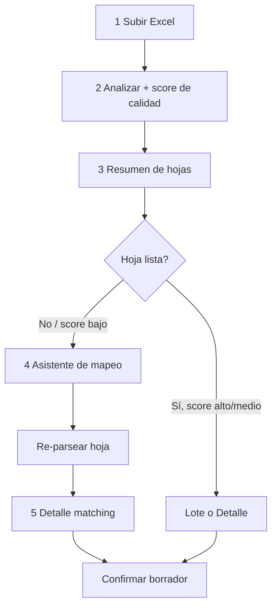

# 17 — Importación asistida de planillas SP (diseño)

Objetivo: aceptar planillas **casi estándar** sin abandonar el diccionario canónico.
Principio: **detectar → confirmar lo dudoso → guardar**.

Alcance: solo el flujo de **Carga de datos → Importar** (`/bioestadistica/captura/importar`).
No modifica el wizard genérico ni los seeders de `.docs-bio/`.

---

## Decisiones acordadas

| Tema | Decisión |
|---|---|
| Asistente de mapeo | **Pantalla propia** (no modal) |
| Alias / memoria de textos | **No se implementa** — el matching queda en niveles 1–4 actuales + decisión manual por fila |
| Tabla nueva | **No** en el alcance vigente (sin `import_alias_items`) |

Si más adelante hiciera falta memoria de typos, se reabre como fase aparte; no forma parte de este diseño.

---

## Problema

Hoy el importador funciona bien cuando la planilla se parece al layout oficial.
Cuando se desvía (encabezado corrido, hoja sin `SP N`, columnas renombradas),
falla o importa a medias (lote salta filas sin match).

Ya existe base reusable:

- Preview en sesión + token
- Overrides de contexto (establecimiento, período, SP, corte)
- Matching 4 niveles (`PrestacionMatcher`)
- Decisiones manuales por fila en detalle
- Lote parcial solo con auto-match

Falta: asistente de layout y calidad visible antes de confirmar.

---

## Flujo propuesto



| Paso | Pantalla | Qué decide el usuario |
|---|---|---|
| 1 | Subir | Archivo `.xls` / `.xlsx` |
| 2 | (servidor) | Detección + score; sin UI propia |
| 3 | Resumen (mejorado) | Contexto + estado por hoja + calidad |
| 4 | Asistente de mapeo (**pantalla propia**) | SP, fila inicio, columnas, establecimiento si falló |
| 5 | Detalle (mejorado) | Matching + aceptar sugerencias nivel 3 + mapear/descartar nivel 4 |
| 6 | Confirm / lote | Igual que hoy; filas sin match se resuelven en detalle |

Los nombres raros de prestaciones se resuelven **solo en esa importación** (select manual en detalle). No se guardan para la próxima.

---

## Fase A — Calidad visible + asistente de layout

**Prioridad 1. Sin tabla nueva.** Reutiliza sesión y overrides actuales.

### A1. Score de calidad por hoja

Al analizar, cada hoja expone un bloque `calidad`:

| Campo | Ejemplo | Uso |
|---|---|---|
| `score` | `0`–`100` | Badge en resumen |
| `nivel` | `alto` / `medio` / `bajo` / `fallido` | Color y CTA |
| `motivos` | lista corta | “Sin SP detectado”, “0 filas”, “40% sin match” |
| `requiere_asistente` | bool | Fuerza o sugiere abrir asistente |

Reglas sugeridas de score (ajustables):

| Condición | Impacto |
|---|---|
| SP detectado e importable | +30 |
| Establecimiento resuelto por código/SIH | +20 |
| Período mes+año detectado | +15 |
| ≥1 fila con métricas > 0 | +15 |
| % match auto (nivel 1–3) ≥ 90% | +20 |
| % match 70–89% | +10 |
| % match &lt; 70% | 0 (+ motivo) |
| Parser error / 0 filas | `fallido` |

### A2. Resumen mejorado

En la tabla de hojas, además de Match auto:

- Badge de calidad (`Alto` / `Medio` / `Bajo` / `Fallido`)
- Botón **Ajustar mapeo** cuando `requiere_asistente` o score &lt; alto
- Tooltip/lista de `motivos`

Lote: solo hojas con `nivel` alto o medio **y** al menos 1 fila auto-match
(igual que hoy: sin match no entra al lote).

### A3. Asistente de mapeo (pantalla propia)

Ruta conceptual: `GET/POST .../importar/mapear?hoja=...`

Secciones:

1. **Identidad de la hoja**
   - Título de hoja (readonly)
   - Formulario SP (select; preselecciona detección si hubo)
   - Advertencia si el usuario cambia SP distinto al detectado

2. **Contexto** (si el resumen global no bastó para esta hoja)
   - Establecimiento (select2; búsqueda por nombre/código/SIH)
   - Año / mes
   - Corte departamento/servicio si aplica

3. **Layout de datos** (solo SP tabulares / apilados / cruzados; SP10/SP11 fase posterior)
   - Fila de inicio de datos (número 1-based, default detectado)
   - Mapeo de columnas mínimas según familia del SP:

| Familia | Columnas a mapear |
|---|---|
| Consultas (SP1) | etiqueta prestación, total consultas |
| Total único (SP2) | etiqueta, total |
| Multi-métrica (SP3/4/7) | etiqueta, pacientes, estudios/prestaciones según form |
| Apilada (SP5/6) | etiqueta, total (bloques) |
| Urgencias (SP9) | etiqueta + columnas fijas del form |
| Cruce (SP8) | etiqueta vacuna + columnas edad/sexo |

UI: por cada rol de columna, un select con las letras/índices detectados
o “Autodetectar”. Preview de 5–10 filas crudas debajo.

4. **Acciones**
   - **Aplicar y reanalizar** → re-parsea solo esa hoja con overrides → vuelve a Detalle
   - Cancelar → resumen

Overrides a persistir en el preview de sesión (por hoja):

```json
{
  "hoja": "Consultas ene",
  "formulario_codigo": "SP1",
  "fila_inicio": 14,
  "columnas": {
    "label": "C",
    "total_consultas": "G"
  },
  "establecimiento_id": 73,
  "periodo_anio": 2026,
  "periodo_mes": 1
}
```

### A4. Criterio de éxito Fase A

- Una planilla con hoja mal nombrada pero layout reconocible se importa tras elegir SP.
- Una planilla con encabezado corrido se importa tras indicar fila de inicio + columnas.
- El lote no empeora: solo importa lo auto-seguro.

---

## Fase B — Parser tolerante (sinónimos de columna)

**Prioridad 2.** Extiende `SpPlanillaParser` / detector de headers.
No inventa prestaciones: solo ayuda a encontrar **columnas** y filas de datos.

Diccionario de sinónimos por rol, ej.:

| Rol | Sinónimos |
|---|---|
| `total_consultas` | total consultas, consultas, tot. consultas, n° consultas |
| `pacientes` | pacientes, nro pacientes, cant. pacientes |
| `especialidad` | especialidad, prestación, servicio, descripción |

Comportamiento:

1. Autodetectar por sinónimo dentro de una ventana de filas (ej. 1–20).
2. Si hay duda entre 2 columnas → score medio + asistente prellenado.
3. Ignorar filas cuyo label normalizado sea `TOTAL`, `SUBTOTAL`, vacío, o solo numérico.

SP10 / SP11: fuera de esta fase salvo bugs; mantener parsers actuales.

---

## Fase C — Operativo (no código de motor)

- Checklist “mínimo aceptable” en la pantalla de subir archivo (3–5 bullets).
- Link a plantilla de referencia (si se publica en storage/templates).
- Mensajes de error accionables: “No se detectó SP → use Ajustar mapeo”.

---

## Reglas de negocio fijas

1. El período **nunca** se toma de la fecha de subida ni mtime del archivo.
2. No auto-crear prestaciones/especialidades desde import.
3. No hay alias persistentes: cada importación rematcha contra el diccionario canónico.
4. Lote sigue siendo **conservador**: sin match / sin layout → no importa esa hoja o esa fila.
5. Sobrescribir solo borradores editables (igual que hoy).
6. Alcance del digitador: solo establecimientos/formularios asignados.
7. Trazabilidad: `origen_carga = importacion_sp` + archivo/hoja.

---

## Pantallas (detalle UX)

### Resumen — estados por hoja

| Estado UI | Significado | CTA |
|---|---|---|
| Listo en lote | Score alto + auto-match | Checkbox lote |
| Revisar matching | Filas parseadas pero varios nivel 4 | Detalle |
| Ajustar mapeo | Sin SP / 0 filas / score bajo | Asistente (pantalla propia) |
| No importable | SP12–14 u otro | Solo info |

### Detalle — matching

Mantener tabla actual y agregar:

- Filtros rápidos: Todas / Sin match / Sugeridas
- Botón “Aplicar todas las sugerencias nivel 3” (con confirmación)
- Link “Ajustar mapeo de esta hoja”

### Asistente — preview crudo

Tabla de 5–10 filas del Excel (celdas texto) con resaltado de columnas mapeadas,
para que el usuario valide visualmente antes de reanalizar.

---

## Orden de implementación sugerido

| Sprint | Entrega | Riesgo |
|---|---|---|
| 1 | Score + badges + CTA “Ajustar mapeo” + pantalla asistente (SP + fila inicio + columnas básicas SP1/SP2/SP3) | Bajo |
| 2 | Asistente para familias SP5/6/8/9 + sinónimos de columna (Fase B) | Medio |
| 3 | Pulido UX, checklist, tests con planillas “sucias” de muestra | Bajo |

Sprint 1 ya desbloquea la mayoría de planillas “casi estándar” (layout corrido / hoja mal nombrada).
Los typos de prestaciones se siguen corrigiendo a mano en el Detalle, sin memoria entre meses.

---

## Tests a planear

- Hoja sin `SP1` en el nombre pero con título interno → asistente asigna SP1 → confirm OK
- Encabezado en fila 15 → `fila_inicio` override → filas detectadas > 0
- Columna “Consultas” en lugar de “Total consultas” → sinónimo o mapeo manual
- Lote no importa filas nivel 4 (siguen yendo a Detalle)
- Sin tablas/columnas de alias en migraciones

Fixtures: copias anonimizadas en tests (no depender solo de `.docs-bio/` gitignored).

---

## Fuera de alcance (explícito)

- Alias / sinónimos persistentes de prestaciones
- OCR / PDF
- Auto-fixar cualquier Excel genérico como SP
- Importación SP12–14 de datos (hasta habilitar `IMPORTABLE`)
- Cambiar el modelo EAV o catálogos maestros
- Persistencia permanente de archivo / `import_jobs` (solo copia temporal de sesión para re-parsear)

---

## Estado

Diseño **aprobado**. Sprints **1, 2 y 3 implementados**:

1. Pantalla propia de mapeo (`/captura/importar/mapear`)
2. Sin alias
3. Score de calidad + badges en resumen
4. Asistente **SP1–SP9** (excepto SP10 nominativo; SP11 queda fuera del asistente de columnas)
5. Sinónimos de columnas (ej. «Consultas» ≈ «Total consultas»)
6. Copia temporal del Excel en sesión (se borra al confirmar/descartar)
7. Sprint 3: checklist en subida, mensajes accionables, filtros en detalle (Todas / Sin match / Sugeridas),
   «Aplicar sugerencias nivel 3», hint de período desfasado, fixtures “sucias” en tests
