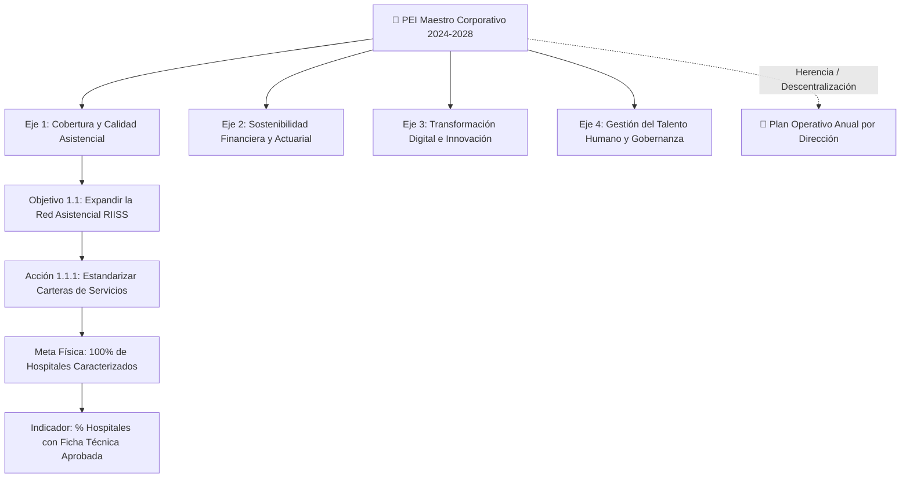

# 01. Plan Estratégico Institucional (PEI) — Metodología y Arquitectura

## 1. Modelo de Cascada PEI (Master y Planes Derivados)

SIPLAN estructura el **Plan Estratégico Institucional** a través de un modelo jerárquico multinivel que conecta la visión del Consejo de Administración con las direcciones operativas:

---

## 2. Motor de Semaforización Automática

La evaluación periódica contrasta la **Meta Programada** con el **Valor Logrado**:

$$\text{Eficacia (\%)} = \left( \frac{\text{Valor Logrado}}{\text{Meta Programada}} \right) \times 100$$

* 🟢 **Verde ($\ge 85\%$)**: Meta cumplida o en curso satisfactorio.
* 🟡 **Amarillo ($60\% - 84.9\%$)**: Alerta preventiva; requiere ajuste de cronograma o reasignación de recursos.
* 🔴 **Rojo ($< 60\%$)**: Desvío crítico; amerita informe de justificación y plan de contingencia ante la Dirección de Planificación.
