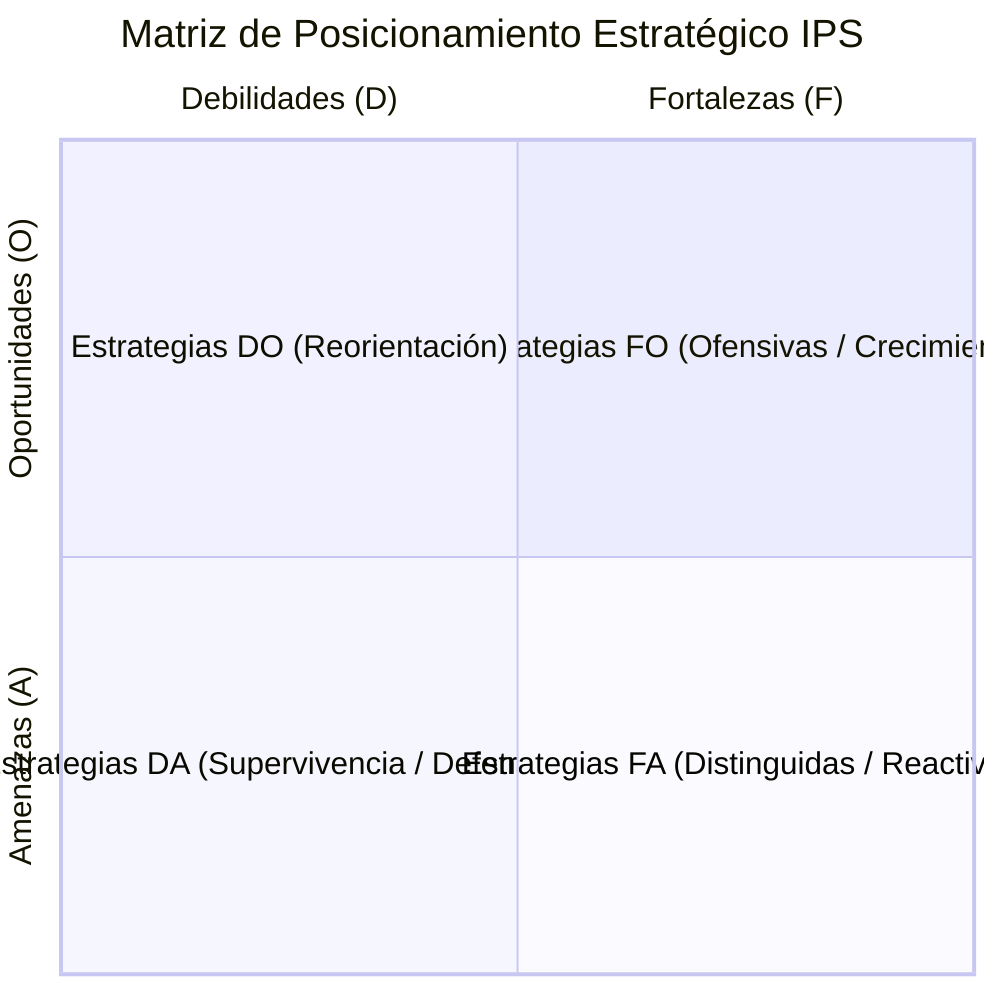

# 02. Diagnóstico FODA Estructurado — Metodología Cuantitativa

## 1. Metodología FODA / IEA en SIPLAN

El módulo de diagnóstico estratégico implementa la metodología cuantitativa de evaluación de factores internos y externos:

### Componentes de Evaluación:
1. **Factores Internos (Fortalezas y Debilidades)**: Ponderación de 0 a 100% y calificación de impacto de 1 a 4.
2. **Factores Externos (Oportunidades y Amenazas)**: Evaluación del entorno regulatorio, demográfico y epidemiológico.
3. **Cruce de Ambientes**: Formulación asistida de iniciativas estratégicas para alimentar directamente el PEI.
