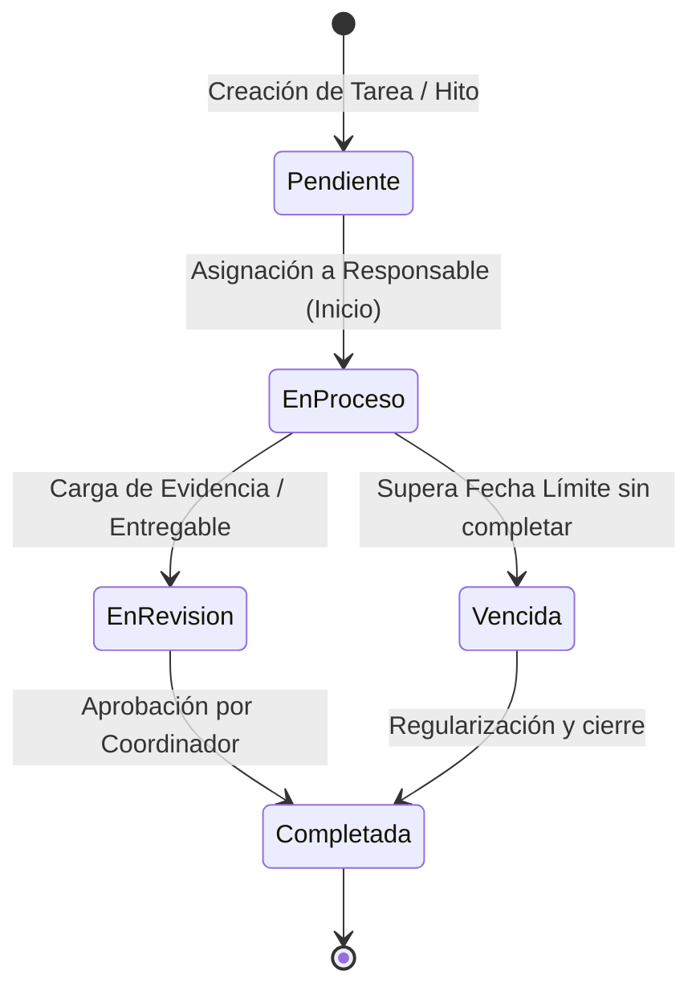

# 03. Gestión de Proyectos y Tareas Operativas

## 1. De la Estrategia a la Acción

El subsistema de **Actividades y Tareas** permite a los equipos de trabajo ejecutar las metas del PEI mediante tableros dinámicos y seguimiento de tareas:

### Funcionalidades:
* **Asignación Multidisciplinaria**: Asignación de colaboradores responsables y observadores.
* **Control de Plazos y Alertas**: Detección automática de tareas vencidas y avisos preventivos.
* **Gamificación & Reconocimiento (SIPLAN GO)**: Puntos y medallas que incentivan la productividad y la colaboración interdepartamental.
