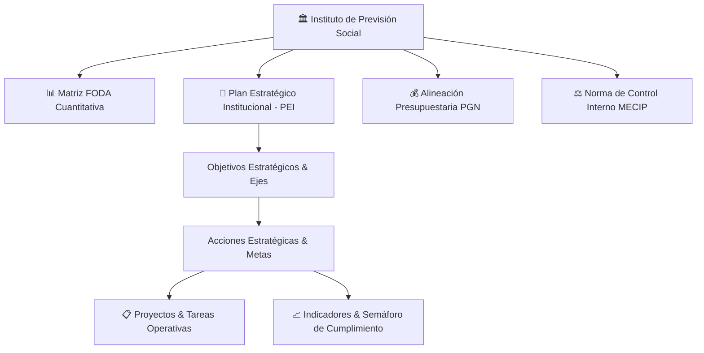

# Módulo de Planificación Estratégica & Gestión de Proyectos

**Instituto de Previsión Social (IPS) — Dirección de Planificación**

---

## 🎯 Visión General

El módulo de **Planificación Estratégica & Gestión de Proyectos** de SIPLAN constituye el núcleo corporativo para la formulación, alineamiento operativo, monitoreo semaforizado y evaluación del **Plan Estratégico Institucional (PEI)** del IPS, integrando herramientas de diagnóstico situacional (FODA Estructurado), control presupuestario (PGN), marco de control interno (MECIP) y ejecución táctica de proyectos mediante tableros de actividades.

---

## 📑 Mapa de Documentación Técnica

| # | Documento | Descripción |
|---|---|---|
| 01 | [Plan Estratégico Institucional (PEI)](01-pei-plan-estrategico.md) | Formulación en cascada (Master/Hijos), ejes, objetivos, metas y semaforización. |
| 02 | [Diagnóstico FODA Estructurado](02-foda-diagnostico-estrategico.md) | Análisis cuantitativo, ponderaciones, cruces FO/FA/DO/DA y matrices de impacto IEA. |
| 03 | [Gestión de Proyectos y Tareas](03-proyectos-y-actividades.md) | Trazabilidad de hitos, responsables, tareas Kanban, estados, vencimientos y gamificación. |
| 04 | [Alineación Presupuestaria (PGN)](04-pgn-presupuesto.md) | Vinculación de metas físicas con objetos de gasto y programas del Presupuesto Nacional. |
| 05 | [Control Interno (MECIP)](05-mecip-control-institucional.md) | Ejes de control, autoevaluación institucional, evidencias y gestión de riesgos. |
| 06 | [Patrimonio y Perfiles Institucionales](06-patrimonios-y-organigrama.md) | Gestión de bienes patrimoniales, dependencias del organigrama y perfiles institucionales. |

---

## 🔑 Roles y Accesos en Planificación

* **`Administrador` / `Super Admin`**: Gestión global de todos los planes, perfiles institucionales, variables y configuración general.
* **`Analista de Planificación` / `Coordinación de Planificación`**: Creación de árboles PEI, formulación de metas, definición de indicadores y matrices FODA.
* **`Analista de Monitoreo PEI`**: Auditoría de avance trimestral/anual, registro de valores logrados y generación de reportes ejecutivos.
* **`Gestor de Actividades` / `Colaborador de Actividades`**: Ejecución de proyectos departamentales, avance de tareas y adjunto de evidencias.
