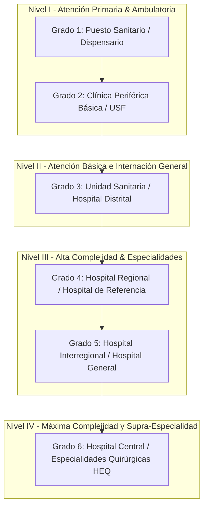
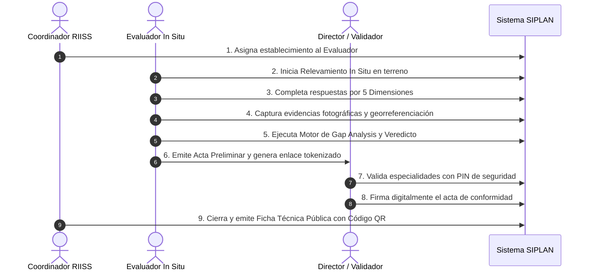

# 01. Modelo Funcional y Marco Normativo — RIISS IPS

## 1. Introducción al Marco RIISS

Las **Redes Integradas e Integrales de Servicios de Salud (RIISS)** constituyen un modelo organizativo y de gestión impulsado por la OPS/OMS y adoptado formalmente por el **Ministerio de Salud Pública y Bienestar Social (MSPBS)** de la República del Paraguay para garantizar la continuidad, integralidad, accesibilidad y calidad de la atención sanitaria.

El **Instituto de Previsión Social (IPS)**, a través de la **Dirección de Planificación**, implementa este módulo con el propósito de:
1. **Auditar la capacidad instalada real** de cada establecimiento de salud mediante relevamientos técnicos *in situ*.
2. **Estandarizar la clasificación de los establecimientos** en 6 Grados de Complejidad homologados entre la nomenclatura MSPBS y la estructura del IPS.
3. **Validar la oferta de especialidades médicas y servicios clínicos** con directores de hospitales y jefes de servicios.
4. **Detectar brechas críticas (Gap Analysis)** entre lo normado para el grado de complejidad y lo efectivamente operativo en terreno.
5. **Vincular la oferta clínica con el Vademécum Oficial del IPS**, garantizando que toda especialidad cuente con los medicamentos esenciales autorizados.

---

## 2. Los 4 Niveles de Atención y los 6 Grados de Complejidad

La red asistencial del IPS se categoriza funcionalmente en cuatro niveles de atención progresiva y seis grados de complejidad:

---

## 3. Criterios Estructurales Obligatorios

Cada grado de complejidad exige el cumplimiento de criterios físicos, asistenciales y tecnológicos verificados en las inspecciones:

* 🏥 **Es Hospitalario**: Capacidad de brindar atención cerrada de internación y guardia médica continua 24/7.
* 🛏️ **Requiere Internación**: Disponibilidad de camas de observación, internación abreviada o cuidados intermedios.
* 🔪 **Requiere Quirófano**: Bloque quirúrgico habilitado para cirugías menores, medianas o mayores según el nivel.
* 🫀 **Requiere UTI**: Unidad de Terapia Intensiva (Adultos, Pediátrica o Neonatal).
* 🚨 **Requiere Urgencias**: Servicio de urgencias y emergencias con sala de reanimación (shock room).

---

## 4. Ciclo de Vida del Relevamiento In Situ

