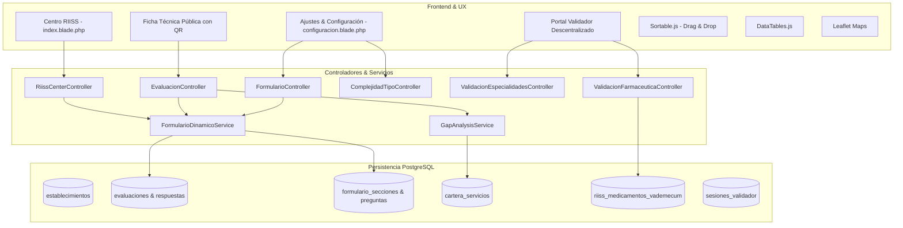

# 02. Arquitectura de Software y Módulos — RIISS IPS

## 1. Arquitectura General del Sistema

El módulo RIISS está construido bajo la arquitectura **MVC (Modelo - Vista - Controlador)** de **Laravel**, integrando capas de servicios especializadas, renderizado de componentes Blade interactivos y consumo asíncrono vía AJAX con JSON.



---

## 2. Mapa de Controladores Principales

| Controlador | Namespace | Responsabilidad Principal |
|---|---|---|
| `RiissCenterController` | `App\Http\Controllers\Admin\Riiss` | Tablero central RIISS, KPIs generales, mapa geográfico, matriz de validación y modal de establecimientos. |
| `FormularioController` | `App\Http\Controllers\Admin\Riiss` | Constructor Drag & Drop de preguntas, reordenamiento por secciones, duplicación, banco universal y tipologías. |
| `ComplejidadTipoController` | `App\Http\Controllers\Admin\Riiss` | Matriz de grados de complejidad (1 al 6), edición vía modal AJAX y recálculo automático de criterios de establecimientos. |
| `EvaluacionController` | `App\Http\Controllers\Admin\Riiss` | Relevamiento in situ, guardado de respuestas, fotos, ejecución de Gap Analysis, actas en PDF y ficha pública. |
| `ValidacionEspecialidadesController` | `App\Http\Controllers\Admin\Riiss` | Generación de enlaces tokenizados para directores, verificación de PIN, validación masiva y exportación de matriz a Excel. |
| `ValidacionFarmaceuticaController` | `App\Http\Controllers\Admin\Riiss` | Portal de Regulación Farmacéutica, cruce de especialidades con el Vademécum IPS y emisión de dictamen farmacéutico. |

---

## 3. Seguridad, Roles y Middleware

El acceso está protegido por el middleware `auth` y controlado mediante permisos Spatie:

```php
// Roles reconocidos por el módulo RIISS
$rolesAutorizados = [
    'Administrador',
    'Super Admin',
    'Coordinación RIISS',
    'Coordinador RIISS',
    'Analista - RIISS',
    'Analista RIISS',
];
```

* **Rutas Privadas (`/riiss/...`)**: Exigen autenticación y rol de Coordinación o Analista.
* **Rutas Públicas Tokenizadas (`/riiss/portal-validador/{token}`)**: Acceso protegido por token criptográfico SHA-256 de 64 caracteres y verificación de PIN numérico de 4 dígitos.
* **Ficha Técnica Pública (`/riiss/evaluaciones/{id}/resumen-publico`)**: Acceso de consulta mediante lectura de Código QR impreso en el acta oficial.
