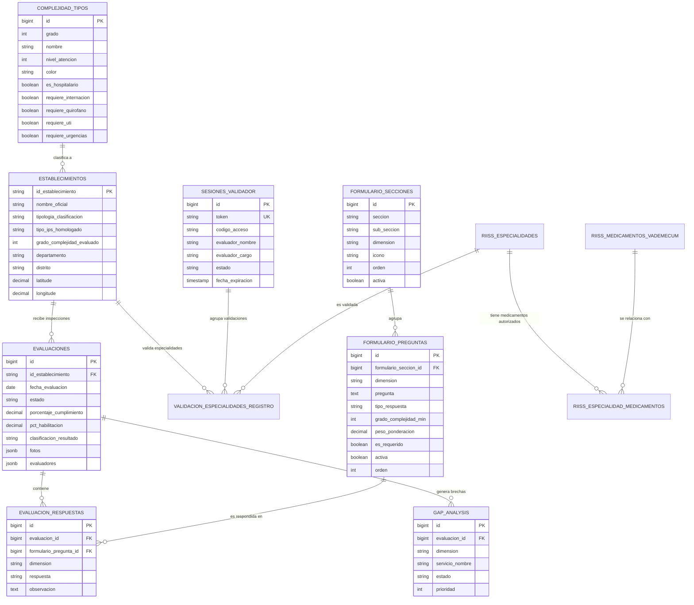

# 03. Modelo de Datos y Diagrama ER — RIISS IPS

## 1. Diagrama Entidad-Relación (Mermaid)

---

## 2. Diccionario de Tablas Principales

### `formulario_secciones`
Representa los bloques organizadores y agrupadores de preguntas.
* `dimension`: Enum (`cartera_servicios`, `infraestructura`, `talento_humano`, `medicamentos_insumos`, `gobernanza_procesos`).
* `seccion`: Nombre del grupo temático principal (VARCHAR 255).
* `sub_seccion`: Sub-agrupador o especialidad médica específica.
* `icono`: Clase FontAwesome para la representación visual en la UI (`fa-stethoscope`, `fa-building`, etc.).

### `formulario_preguntas`
Banco universal de preguntas evaluativas.
* `dimension`: Dimensión estratégica de pertenencia.
* `tipo_respuesta`: `si_no_na` (Sí/No/No Aplica), `si_no`, `texto`, `numero`, `checklist`.
* `grado_complejidad_min`: Grado mínimo normativo (1 al 6) requerido para exigir la pregunta.
* `peso_ponderacion`: Ponderación numérica (0.1 a 10.0) para el cálculo de porcentaje.

### `evaluaciones` y `evaluacion_respuestas`
Registro de la inspección técnica *in situ*.
* `porcentaje_cumplimiento`: Porcentaje global calculado sobre preguntas requeridas.
* `pct_habilitacion`: Porcentaje de requisitos estructurales indispensables.
* `clasificacion_resultado`: Veredicto técnico (`CUMPLE`, `CUMPLE_PARCIALMENTE`, `NO_CUMPLE`).
* `fotos`: JSON con URLs, títulos y descripciones de las evidencias fotográficas.
