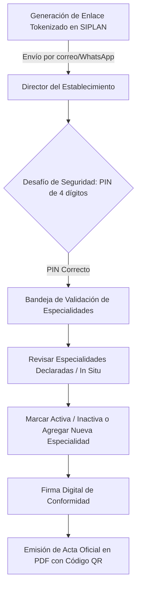

# 06. Portal Validador y Regulación Farmacéutica — RIISS IPS

## 1. Portal de Validación Digital Descentralizado

El **Portal Validador** permite a directores de hospitales y jefes médicos validar formalmente las especialidades operativas de su establecimiento sin necesidad de contar con una cuenta previa en el sistema.

### Mecanismos de Seguridad:
* **Token Criptográfico**: Hash SHA-256 de 64 caracteres de un solo uso por período de auditoría.
* **PIN de Autenticación**: Código numérico de 4 dígitos validado mediante `POST /riiss/portal-validador/{token}/verificar-pin`.
* **Tiempo de Expiración**: Sesión configurable (por defecto 72 horas).

---

## 2. Regulación Farmacéutica y Vademécum Oficial IPS

El subsistema de **Regulación Farmacéutica** (`/riiss/portal-farmaceutico/{token}`) asegura que cada especialidad médica validada disponga de los medicamentos autorizados según el **Vademécum Oficial del IPS 2026**.

* **Matriz de Control Cruzado**: Cruza la oferta médica con el listado de fármacos del cuadro básico.
* **Dictamen Farmacéutico**: Permite a la Unidad de Regulación Farmacéutica emitir dictámenes de cobertura, observaciones técnicas o bloqueos por desabastecimiento.
* **Exportación Consolidada**: Genera reportes ejecutivos en formato Excel (`XLSX`) con la matriz de cobertura farmacéutica por área de gestión y hospital.
