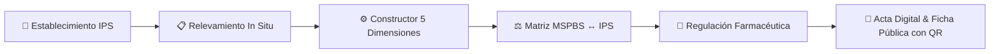

# Módulo RIISS — Redes Integradas e Integrales de Servicios de Salud

**Instituto de Previsión Social (IPS) — Dirección de Planificación**

---

## 🎯 Visión General

El módulo **RIISS (Redes Integradas e Integrales de Servicios de Salud)** de SIPLAN constituye la plataforma tecnológica corporativa diseñada para auditar, relevar in situ, validar digitalmente y caracterizar los **138+ establecimientos de salud** del IPS en todo el territorio de la República del Paraguay.

Alineado a las políticas nacionales de salud y al marco normativo del **Ministerio de Salud Pública y Bienestar Social (MSPBS)**, el sistema permite evaluar la capacidad resolutiva de la red, comparar los servicios declarados versus observados en terreno (Gap Analysis), y certificar la oferta médica bajo **5 Dimensiones Estratégicas**.

---

## 📑 Mapa de Documentación Técnica

| # | Documento | Descripción |
|---|---|---|
| 01 | [Modelo Funcional y Marco Normativo](01-modelo-funcional-y-marco-legal.md) | Fundamentos de RIISS, niveles de atención, tipología y objetivos institucionales. |
| 02 | [Arquitectura y Módulos](02-arquitectura-y-modulos.md) | Arquitectura de controladores, servicios, rutas, seguridad por roles y middleware. |
| 03 | [Modelo de Datos y Diagrama ER](03-modelo-datos-y-er.md) | Estructura relacional PostgreSQL, llaves foráneas, índices y diagramas Mermaid. |
| 04 | [Dimensiones y Constructor Drag & Drop](04-dimensiones-y-constructor-drag-drop.md) | Las 5 Dimensiones, banco universal de preguntas y constructor visual con Sortable.js. |
| 05 | [Matriz de Equiparación MSPBS ↔ IPS](05-matriz-equiparacion-mspbs-ips.md) | Tabla de correspondencia de 6 Grados, criterios estructurales y recálculo automático. |
| 06 | [Portal Validador y Regulación Farmacéutica](06-portal-validador-y-regulacion-farmaceutica.md) | Acceso por PIN/Token, validación de especialidades y cruce con Vademécum IPS. |
| 07 | [Relevamiento In Situ y Gap Analysis](07-relevamiento-in-situ-y-evaluaciones.md) | Proceso de visita técnica, captura fotográfica con Lightbox, motor de brechas y veredictos. |
| 08 | [Fichas Técnicas Públicas, Actas y Reportes](08-actas-fichas-tecnicas-y-reportes.md) | Renderizado de Fichas Técnicas con QR, actas oficiales, DomPDF con Base64 e impresión. |
| 09 | [Seeders, Ingestión y Mantenimiento](09-seeders-ingestion-y-mantenimiento.md) | Ingestión masiva de estudios consolidados Excel con PhpSpreadsheet y comandos de producción. |

---

## 🔑 Roles y Accesos en RIISS

* **`Coordinación RIISS` / `Coordinador RIISS`**: Acceso integral al Centro RIISS, creación y cierre de evaluaciones, gestión de enlaces de validación, matriz de control farmacéutico y configuración de formularios.
* **`Analista - RIISS` / `Analista RIISS`**: Acceso al Centro RIISS y ejecución de relevamientos técnicos in situ, carga de respuestas y fotografías.
* **`Validador Externo / Director de Hospital` (Portal Tokenizado)**: Acceso público protegido mediante token único y PIN de seguridad para certificar especialidades activas y asentar firma digital en actas de relevamiento.
